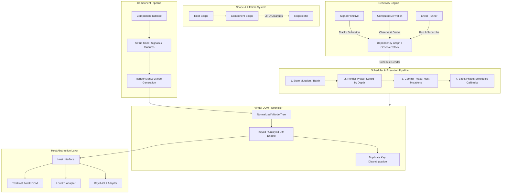

# Hydronium Architecture Specification

## 1. Executive Overview

Hydronium is a high-performance, fine-grained reactive UI library designed natively for Lua environments (Lua 5.1, 5.2, 5.3, 5.4, and LuaJIT). It combines the declarative ergonomics of component-driven UI frameworks with the surgical performance of fine-grained reactive dependency tracking and a host-agnostic virtual DOM reconciler.

---

## 2. Core Subsystems

### 2.1 Fine-Grained Reactivity (`hydronium.signals`)
Hydronium does not rely on dirty-checking or coarse top-down tree invalidation to detect state changes. Instead, state is encapsulated within reactive **Signals**:
- **Signals** (`createSignal` / `signal`): Value containers that notify registered observers when their values change.
- **Computeds** (`createComputed` / `computed`): Memoized derivations that dynamically track upstream dependencies and lazily re-evaluate only when queried.
- **Effects** (`createEffect` / `effect`): Side-effect runners that automatically bind to the active reactive scope, re-running whenever their dependencies mutate.
- **Dynamic Dependency Pruning**: When conditional branches execute (e.g. `if cond() then a() else b() end`), dependencies no longer accessed are automatically pruned from the observer graph.

### 2.2 Hierarchical Scopes (`hydronium.core.scope`)
Memory management and cleanup semantics in Lua require deterministic lifecycle controls:
- **Hierarchical Lifecycles**: Every component instance and effect lives inside a `Scope`. Child scopes are bound to parent scopes.
- **LIFO Disposal**: Cleanups registered via `scope:defer(fn)` or `onCleanup(fn)` execute in strict Last-In, First-Out (LIFO) order.
- **Resilient Execution**: Every cleanup callback is wrapped in `pcall`. If a cleanup callback fails, the error is captured and remaining cleanups are guaranteed to run.

### 2.3 Phased Execution Scheduler (`hydronium.core.scheduler`)
To prevent infinite update loops and visual inconsistencies, Hydronium divides updates into four distinct phases:
1. **Mutation Phase**: Signal updates are applied. If within a `batch()` block, downstream notifications are coalesced.
2. **Render Phase**: Dirty components re-render into new Virtual DOM subtrees. Components in the render queue are sorted by tree depth (`parent < child`) so parent components always re-render before children, preventing redundant renders.
3. **Commit Phase**: The Virtual DOM Reconciler diffs the previous and new subtrees, issuing surgical mutations to the Host adapter (`commitUpdate`, `insertBefore`, `removeChild`).
4. **Effect Phase**: Scheduled side-effects run. Signal updates originating from within effects are queued safely to ensure that the current effect pass completes before the next render phase begins (Amendment 3).

### 2.4 Virtual DOM Reconciler (`hydronium.core.reconciler`)
The reconciler mediates between declarative VNodes and physical host instances:
- **Host Agnosticism**: The core reconciler knows nothing about graphics APIs, DOM elements, or windowing libraries. It operates entirely through an abstract `Host` interface.
- **Keyed List Reconciliation**: Matches elements across renders by `key`, preserving physical host node identity during reordering, insertion, and deletion.
- **Duplicate Key Hardening (Amendment 4)**: If siblings share identical keys, the reconciler disambiguates them gracefully (`key:__dup_N`), preventing orphaned VNodes or unmounting bugs.

---

## 3. Lua Runtime Invariants & Trade-offs

| Dimension | Hydronium Strategy | Rationale in Lua Runtime |
| :--- | :--- | :--- |
| **Lua Compatibility** | Standard 5.1 to 5.4 + LuaJIT | Uses `table.unpack or unpack`, `select("#", ...)` vararg processing, and avoids version-dependent syntax. |
| **Garbage Collection** | Deterministic scope disposal | Never relies on `__gc` on plain tables. Cleanups are triggered synchronously when components unmount. |
| **Table Allocations** | Contiguous 1-indexed tables | Maximizes LuaJIT array part utilization; avoids hash part resizing overhead. |
| **Purity Guard** | Render-phase mutation error | Forbids mutating signals during render execution to guarantee pure, idempotent render passes. |
| **Stack Integrity** | Protected observer evaluation | Restores the tracking stack (`popObserver()`) inside protected blocks even if user computations throw. |

---

## 4. Architectural Boundaries

1. **Reactivity does not touch the Host directly**: Signals notify the Scheduler and Components; only the Reconciler communicates with the Host.
2. **Components do not mutate siblings**: State is localized via Signals or lifted via hierarchical Contexts.
3. **Cleanups never crash unmounting**: Scope disposal captures all exceptions and continues teardown across the subtree.
