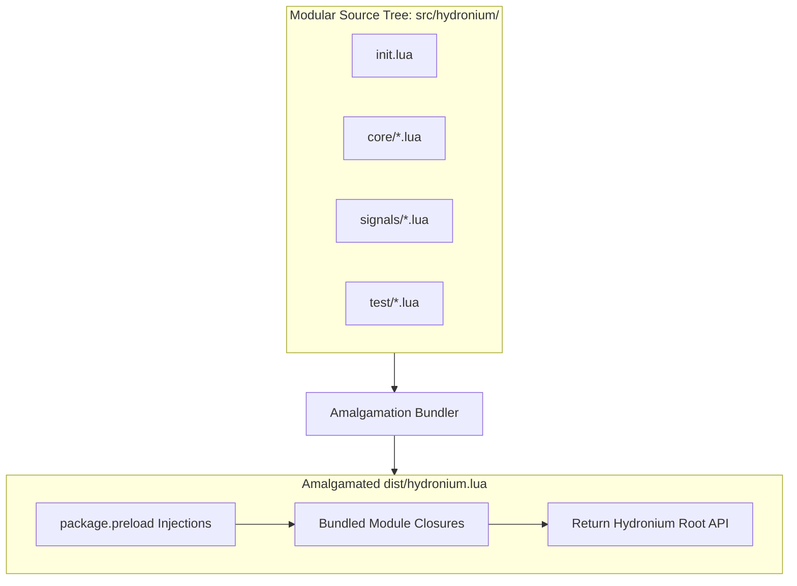

# Hydronium Bundling & Distribution Specification

## 1. Distribution Philosophy

Hydronium adheres to three core distribution principles:
1. **Zero External Runtime Dependencies**: Hydronium runs directly on vanilla Lua 5.1, 5.2, 5.3, 5.4, or LuaJIT without requiring C extensions or third-party Lua rocks.
2. **Dual-Format Distribution**: Available both as a modular package for package managers (Moonstone, LuaRocks) and as a single-file zero-dependency amalgamated script (`dist/hydronium.lua`).
3. **Submodule Preloading Invariance**: Subpath requires (e.g. `require("hydronium.signals")`, `require("hydronium.test")`) work identically whether consuming the modular directory or the single-file amalgamation.

---

## 2. Package Managers

### 2.1 Moonstone (`moonstone.toml`)
Hydronium is configured for modern Lua package management via [Moonstone](https://github.com/moonstone-lua):

```toml
[package]
name = "hydronium"
version = "0.1.0"
description = "Fine-grained reactive UI framework for Lua and LuaJIT"
authors = ["Hydronium Contributors"]
license = "MIT"
entry = "src/hydronium/init.lua"

[dependencies]
# Zero runtime dependencies
```

### 2.2 LuaRocks (`hydronium-0.1.0-1.rockspec`)
For standard LuaRocks distribution:

```lua
package = "hydronium"
version = "0.1.0-1"

source = {
  url = "git+https://github.com/hydronium-ui/hydronium.git",
  tag = "v0.1.0"
}

description = {
  summary = "Fine-grained reactive UI framework for Lua & LuaJIT",
  detailed = [[
    A high-performance reactive UI framework for game engines, desktop,
    web, and CLI applications written natively in Lua and LuaJIT.
  ]],
  homepage = "https://github.com/hydronium-ui/hydronium",
  license = "MIT"
}

dependencies = {
  "lua >= 5.1"
}

build = {
  type = "builtin",
  modules = {
    ["hydronium"] = "src/hydronium/init.lua",
    ["hydronium.core"] = "src/hydronium/core/init.lua",
    ["hydronium.core.symbols"] = "src/hydronium/core/symbols.lua",
    ["hydronium.core.errors"] = "src/hydronium/core/errors.lua",
    ["hydronium.core.scope"] = "src/hydronium/core/scope.lua",
    ["hydronium.core.element"] = "src/hydronium/core/element.lua",
    ["hydronium.core.ref"] = "src/hydronium/core/ref.lua",
    ["hydronium.core.context"] = "src/hydronium/core/context.lua",
    ["hydronium.core.scheduler"] = "src/hydronium/core/scheduler.lua",
    ["hydronium.core.component"] = "src/hydronium/core/component.lua",
    ["hydronium.core.reconciler"] = "src/hydronium/core/reconciler.lua",
    ["hydronium.signals"] = "src/hydronium/signals/init.lua",
    ["hydronium.signals.graph"] = "src/hydronium/signals/graph.lua",
    ["hydronium.signals.signal"] = "src/hydronium/signals/signal.lua",
    ["hydronium.signals.computed"] = "src/hydronium/signals/computed.lua",
    ["hydronium.signals.effect"] = "src/hydronium/signals/effect.lua",
    ["hydronium.signals.batch"] = "src/hydronium/signals/batch.lua",
    ["hydronium.test"] = "src/hydronium/test/init.lua",
    ["hydronium.test.host"] = "src/hydronium/test/host.lua",
    ["hydronium.test.tree"] = "src/hydronium/test/tree.lua",
    ["hydronium.test.act"] = "src/hydronium/test/act.lua"
  }
}
```

---

## 3. Single-File Amalgamation Architecture

For game engines (LÖVE 2D, Defold) or single-file scripts where multi-file directory structures are cumbersome, Hydronium compiles into an amalgamated `dist/hydronium.lua`.



### 3.1 Preload Registration Technique
The bundler wraps each source file into an entry in `package.preload`:

```lua
-- dist/hydronium.lua (Amalgamation Template)
do
  local modules = {}
  
  modules["hydronium.core.symbols"] = function()
    -- Content of src/hydronium/core/symbols.lua
  end

  modules["hydronium.core.errors"] = function()
    -- Content of src/hydronium/core/errors.lua
  end

  -- ... (all other modules)

  -- Register loaders into Lua's native package.preload table
  for modname, loader in pairs(modules) do
    if not package.preload[modname] then
      package.preload[modname] = loader
    end
  end
end

-- Return primary module
return package.preload["hydronium"]()
```

### Benefits of Preload Injection:
1. **Seamless Subpath `require`**: Code requiring `require("hydronium.signals")` works out-of-the-box without requiring physical files on the disk.
2. **Lazy Initialization**: Modules are only instantiated when first required.
3. **No Global Pollution**: Leaves global `_G` untouched.

---

## 4. Lua Runtime Compatibility Guardrails

To run identically across Lua 5.1, 5.2, 5.3, 5.4, and LuaJIT, the bundled code strictly abides by the following rules:

### 4.1 Unpack Compatibility Shim
Lua 5.1 defines global `unpack`, while Lua 5.2+ moved it to `table.unpack`. Every module that needs `unpack` uses:
```lua
local unpack = table.unpack or unpack
```

### 4.2 Safe Varargs Handling
Never assume `#{...}` is accurate when arguments may include `nil`. Always use:
```lua
local n = select("#", ...)
for i = 1, n do
  local child = select(i, ...)
  -- process child
end
```

### 4.3 Table Garbage Collection Invariant
In Lua 5.1, standard tables do NOT invoke the `__gc` metamethod (only userdata do). Lua 5.2+ and LuaJIT with compat flags do. Hydronium **never** relies on `__gc` for table lifecycle or resource management. All resource cleanup is deterministic and explicit through `scope:dispose()` and `scope:defer()`.

### 4.4 Read-Only Metatable Guards
Hydronium implements element immutability via:
- `newproxy(true)` when available (Lua 5.1 and LuaJIT), which supports `__len` and erroring `__newindex`.
- Metatables with `__newindex` throwing errors and an internal `_store` backing for compatibility across all Lua versions.

---

## 5. Minification Strategies

When bundling for size-sensitive environments (such as web browsers via WebAssembly/Wasmoon or embedded IoT devices):
- **Safe Symbol Minification**: Internal local variables and function names can be aggressively mangled.
- **Table Key Protection**: Public API property names (e.g. `type`, `props`, `children`, `key`, `ref`, `value`, `get`, `set`) and host interface methods must NOT be renamed unless the minifier supports complete AST call-site tracking.
- **Recommended Minifiers**: `luasrcdiet` or `LuaMinify` run with string literal preservation.
