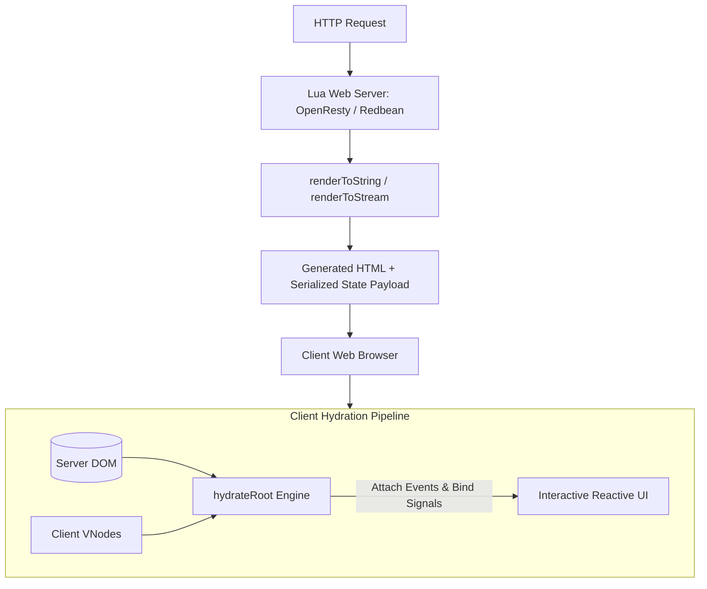
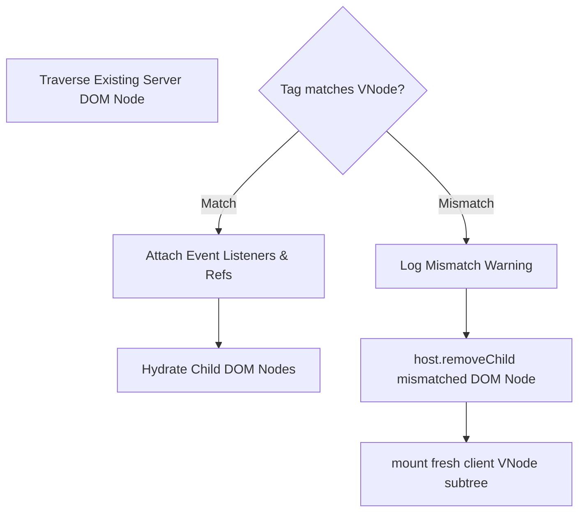

# Hydronium Future SSR & Hydration Specification

## 1. Executive Summary & Vision

Server-Side Rendering (SSR) and Hydration enable Hydronium applications to serve pre-rendered HTML from Lua-powered backend environments (OpenResty/Nginx, Redbean, Lwan, Pegasus, or embedded game servers), followed by client-side activation without tearing down the existing DOM.



---

## 2. Server-Side Rendering (SSR)

### 2.1 Synchronous String Rendering (`renderToString`)
`renderToString` transforms a VNode tree directly into an HTML string without instantiating any host DOM nodes or scheduling reactive side-effects.

```lua
local H = require("hydronium")

local function Page(props)
  return H.h("div", { class = "container" },
    H.h("h1", nil, props.title),
    H.h("p", nil, "Server timestamp: " .. props.time)
  )
end

local html = H.ssr.renderToString(H.h(Page, { title = "Hydronium Web", time = os.time() }))
-- Output: '<div class="container"><h1>Hydronium Web</h1><p>Server timestamp: 1725580000</p></div>'
```

#### SSR Invariants:
1. **No Reactive Observers**: Computeds evaluate synchronously once. Effects (`createEffect`) do **NOT** run on the server, avoiding timer leaks and asynchronous orphan tasks.
2. **Context & Scopes**: Scopes are created for the duration of `renderToString` and disposed immediately upon completion.
3. **HTML Attribute Escaping**: All text content and prop values are escaped to prevent XSS vulnerabilities:
   - `&` -> `&amp;`
   - `<` -> `&lt;`
   - `>` -> `&gt;`
   - `"` -> `&quot;`
   - `'` -> `&#39;`
4. **Void Elements**: Elements like ``, `<input>`, `<br>`, `<hr>`, `<meta>`, `<link>` are rendered as self-closing without child content.
5. **Boolean Attributes**: Properties with `true` (e.g. `disabled = true`, `checked = true`) emit `<button disabled>` rather than `<button disabled="true">`.

---

### 2.2 Asynchronous Streaming SSR (`renderToStream`)
For environments with high concurrency and streaming HTTP support (OpenResty, Node.js Lua runtimes):

```lua
H.ssr.renderToStream(H.h(App), {
  onChunk = function(chunk)
    ngx.print(chunk)
    ngx.flush(true)
  end,
  onComplete = function()
    ngx.eof()
  end,
  onError = function(err)
    ngx.log(ngx.ERR, "SSR Stream error: " .. tostring(err))
  end
})
```

- **Chunked Output**: Emits HTML chunks as soon as parts of the component tree finish rendering.
- **Suspense Placeholders**: When an asynchronous data source is pending, the stream emits a fallback placeholder with a unique hydration comment marker (`<!--$?-->`). Once the data resolves, an inline `<template>` and `<script>` chunk stream down to replace the placeholder in the live DOM.

---

## 3. Client Hydration Architecture

### 3.1 The `hydrateRoot` Protocol
Hydration reconciles existing physical DOM nodes against the incoming Virtual DOM tree, attaching event listeners and reactive subscriptions without recreating DOM elements.

```lua
local H = require("hydronium")

-- Client bootstrap
local rootEl = js.global.document:getElementById("app")
H.hydrateRoot(rootEl, H.h(App))
```

### 3.2 Non-Destructive DOM Walker
The hydration engine uses a depth-first DOM traversal:
1. **Tag Verification**: The engine checks if `domNode.nodeName:lower() == vnode.type`.
2. **Event Listener Attachment**: Iterates over `vnode.props` and binds event listeners (`onClick`, `onInput`) to the existing DOM node.
3. **Ref Binding**: Assigns `vnode.ref.current = domNode` or invokes `vnode.ref(domNode)`.
4. **Children Hydration**: Steps through `domNode.childNodes`, matching each against `vnode.children`.



---

## 4. Mismatch Recovery & Resiliency

A hydration mismatch occurs when server-rendered HTML diverges from the client initial render (e.g. due to client-only state, localization differences, or browser extensions mutating the DOM).

### Recovery Strategy:
1. **Non-Crashing Recovery**: Mismatches never crash the application.
2. **Subtree Replacement**:
   - The engine logs a detailed diagnostic warning:
     `[Hydration Mismatch]: Expected <button> but found <div> at path "div.container > main > div"`
   - The mismatched server DOM node is safely detached via `parent:removeChild(mismatchedNode)`.
   - The client-rendered VNode is cleanly mounted via `mount(vnode, parent)`.
3. **Sibling Isolation**: A mismatch in one child does not invalidate unaffected siblings; hydration resumes on subsequent sibling nodes.

---

## 5. State Serialization & Dehydration

To avoid hydration mismatches, client signals must initialize with the identical state used during server rendering.

### The Serialization Pattern:
```html
<!-- Server HTML Output -->
<div id="app">...</div>
<script id="__HYDRONIUM_STATE__" type="application/json">
  {"user":{"id":42,"name":"Ada"},"theme":"dark"}
</script>
```

```lua
-- Client Hydration Entry
local stateJson = js.global.document:getElementById("__HYDRONIUM_STATE__").textContent
local initialState = json.decode(stateJson)

-- Initialize client signals with hydrated data
local user, setUser = H.createSignal(initialState.user)
local theme, setTheme = H.createSignal(initialState.theme)

H.hydrateRoot(js.global.document:getElementById("app"), H.h(App, { user = user, theme = theme }))
```
