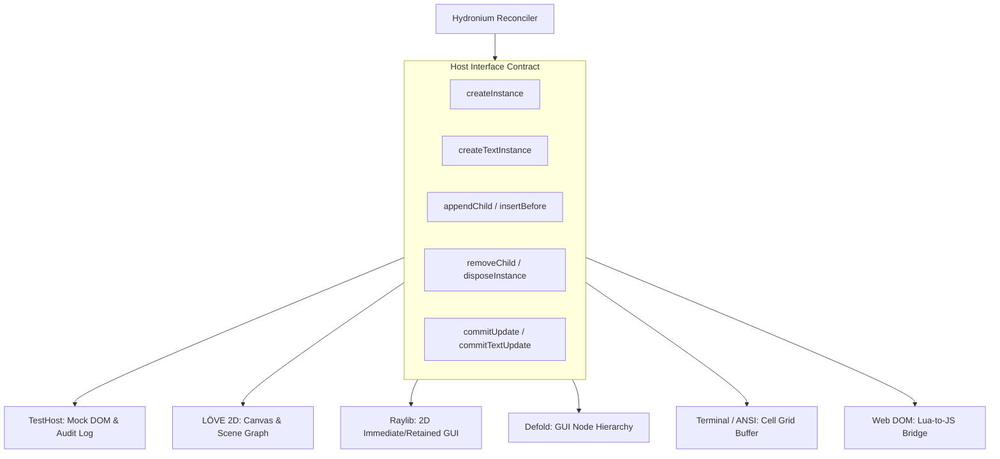
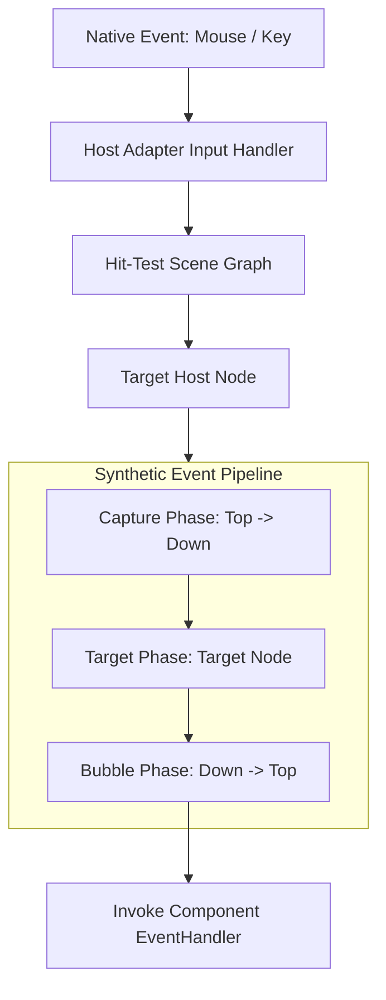

# Hydronium Host Adapter Architecture

## 1. Overview & Host Protocol

Hydronium is completely decoupled from any single rendering target. The core runtime manages reactive state, component scopes, and Virtual DOM diffing, while delegating physical rendering and event handling to a **Host Adapter**.



### The Host Interface Contract

Every host adapter provides a table implementing the following methods:

```lua
local HostInterface = {
  createInstance = function(type, props) end,
  createTextInstance = function(text) end,
  appendInitialChild = function(parent, child) end,
  appendChild = function(parent, child) end,
  insertBefore = function(parent, child, beforeChild) end,
  removeChild = function(parent, child) end,
  commitUpdate = function(instance, oldProps, newProps) end,
  commitTextUpdate = function(instance, oldText, newText) end,
  disposeInstance = function(instance) end,
}
```

---

## 2. Standard Host Implementations

### 2.1 TestHost (`hydronium.test.host`)
The reference in-memory host implementation bundled with Hydronium for unit testing.

- **Data Structure**: Standard Lua tables representing a mock DOM tree.
- **Audit Logging**: Maintains a chronological `auditLog` of every host operation (`createInstance`, `commitUpdate`, `removeChild`, etc.).
- **Zero Dependencies**: Pure LuaJIT / Lua 5.1-5.4 compatible.

```lua
local TestHost = require("hydronium.test.host")
local host = TestHost.new()

-- Inspect operations
local node = host.createInstance("button", { id = "submit" })
print(host.auditLog[1].op) -- "createInstance"
```

---

### 2.2 LÖVE 2D Host (`love2d`)
Targeting the LÖVE 2D game engine.

- **Scene Graph Representation**: Retained-mode display tree where nodes store calculated bounds (`x, y, w, h`), styling (`color`, `cornerRadius`), and draw callbacks.
- **Render Loop**:
  ```lua
  function love.draw()
    rootHostNode:draw()
  end
  ```
- **Event Handling**: Maps LÖVE callbacks (`love.mousepressed`, `love.mousereleased`, `love.keypressed`) to synthetic events routed through the hit-tested scene graph.

```lua
local LoveHost = {}

function LoveHost.createInstance(type, props)
  return {
    type = type,
    props = props,
    children = {},
    x = props.x or 0,
    y = props.y or 0,
    w = props.w or 100,
    h = props.h or 30,
    draw = function(self)
      if self.type == "button" then
        love.graphics.setColor(self.props.color or {0.2, 0.4, 0.8})
        love.graphics.rectangle("fill", self.x, self.y, self.w, self.h, 6)
      end
      for _, child in ipairs(self.children) do
        child:draw()
      end
    end
  }
end
```

---

### 2.3 Raylib Host (`raylib-lua`)
Targeting 2D applications using Raylib.

- **Hybrid Immediate/Retained**: Nodes hold styling and bounds. In `commitUpdate`, layout coordinates are updated.
- **Rendering**: In the main `while not WindowShouldClose() do` loop, nodes are rendered using Raylib draw functions:
  ```lua
  DrawRectangle(node.x, node.y, node.w, node.h, node.color)
  DrawText(node.text, node.x + 10, node.y + 8, 20, RAYWHITE)
  ```

---

### 2.4 Defold Host (`defold`)
Targeting the Defold game engine GUI subsystem.

- **Node Mapping**: Maps `type == "box"` to `gui.new_box_node()` and `type == "text"` to `gui.new_text_node()`.
- **Parenting**: Uses Defold native hierarchy calls:
  ```lua
  function DefoldHost.appendChild(parent, child)
    gui.set_parent(child.node, parent.node)
    table.insert(parent.children, child)
  end
  ```
- **Cleanup**: `gui.delete_node(instance.node)` invoked in `disposeInstance`.

---

### 2.5 Terminal / ANSI Host (CLI TUI)
Targeting command-line interface tools and terminal dashboards.

- **Virtual Cell Grid**: Maintains a two-dimensional grid buffer of characters, foreground colors, and background colors.
- **Double Buffering**: Diffs the new buffer against the active terminal buffer, emitting ANSI escape sequences (`\27[y;xH`) only for cells that changed.
- **Input Dispatching**: Dispatches raw ANSI stdin inputs (arrow keys, Enter, mouse escape sequences) to focused interactive nodes.

---

### 2.6 Browser DOM Host (WebAssembly / Lua.js)
Targeting browser environments running Lua via WebAssembly (e.g. Wasmoon) or Lua-in-JS runtimes.

- **Direct DOM Manipulation**:
  ```lua
  function DomHost.createInstance(type, props)
    local el = js.global.document:createElement(type)
    for k, v in pairs(props) do
      if k:sub(1, 2) == "on" then
        el:addEventListener(k:sub(3):lower(), v)
      else
        el:setAttribute(k, v)
      end
    end
    return el
  end
  ```

---

## 3. Synthetic Event Dispatching

Hydronium encourages a unified event model across all host adapters:



### Synthetic Event Table Contract
```lua
local event = {
  type = "click",
  target = targetNode,
  currentTarget = currentNode,
  stopPropagation = function() isStopped = true end,
  preventDefault = function() isPrevented = true end,
  defaultPrevented = false,
  timestamp = os.clock(),
}
```

---

## 4. Host Verification & Testing Patterns

Hosts can be rigorously validated by asserting against their audit logs in unit tests:

```lua
local function verifyHostMutations()
  local host = TestHost.new()
  local root = H.createRoot(host)

  root:render(H.h("div", { id = "a" }, "Hello"))
  
  -- Verify creation
  assert(host.auditLog[1].op == "createInstance")
  assert(host.auditLog[1].type == "div")

  -- Verify surgical update
  root:render(H.h("div", { id = "b" }, "Hello"))
  local lastOp = host.auditLog[#host.auditLog]
  assert(lastOp.op == "commitUpdate")
  assert(lastOp.newProps.id == "b")
end
```
