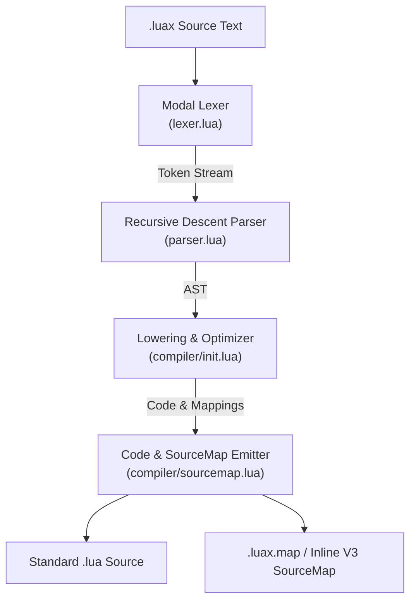

# Hydronium .luax Compiler Architecture & Lowering Pipeline

## 1. Overview

The Hydronium `.luax` compiler transforms declarative LuaX markup into standard, portable Lua code (compatible with Lua 5.1, 5.2, 5.3, 5.4, and LuaJIT). The compiler is designed to be:
- **Zero-Dependency**: Written entirely in pure, standard Lua.
- **High-Performance**: Streaming lexer and recursive descent parser with minimal heap allocations.
- **Host-Agnostic**: Contains zero hardcoded HTML/SVG tag names, relying on the `Environment<I>` protocol.
- **Source-Mapped**: Emits SourceMap v3 mappings with Base64 VLQ encoding to maintain debuggability in browser devtools, Neovim, and VSCode.

---

## 2. Compilation Pipeline

The compilation pipeline consists of four discrete stages:



### Stage 1: Lexical Analysis (`lexer.lua`)
The modal lexer tracks source coordinates (`line`, `column`, `offset`) and transitions dynamically between `LUA`, `JSX_TAG`, and `JSX_CHILDREN` modes. It resolves operator ambiguities (`<tag` vs `a < b`), decodes XML entities, and isolates embedded expressions (`{ ... }`) and comments (`{-- ... --}`).

### Stage 2: Parsing & AST Construction (`parser.lua`)
A single-pass recursive descent parser validates XML well-formedness, matches closing tags with opening tags, handles self-closing tags, and constructs the strongly-typed Abstract Syntax Tree. In IDE or recovery mode, syntax errors are collected into a `diagnostics` array rather than halting immediately.

### Stage 3: Lowering & Transformation (`compiler/init.lua`)
The compiler transforms JSX AST nodes into valid Lua expressions:
- Intrinsic elements become `__luax.element("tag", props, ...children)`
- Component elements become `__luax.element(Comp, props, ...children)`
- Fragments become `__luax.fragment(...children)`
- Attributes and spreads are partitioned and lowered into either static table constructors or `__luax.spread(...)` calls.

### Stage 4: Code Emission & Source Mapping (`compiler/sourcemap.lua`)
The emitter outputs formatted Lua code while recording line and column mappings for every token. It serializes these mappings into the standard SourceMap v3 JSON format with Base64 VLQ segments.

---

## 3. AST Node Specification

All AST nodes include a `loc` table recording source spans:
```lua
loc = {
    start = { line = 1, column = 1, offset = 1 },
    ["end"] = { line = 1, column = 24, offset = 24 }
}
```

### Node Types

| Node Type | Fields | Description |
|---|---|---|
| `JSXElement` | `opening_element`, `children`, `closing_element` | Full element node |
| `JSXOpeningElement` | `name`, `attributes`, `self_closing` | Tag opening or self-closing tag |
| `JSXClosingElement` | `name` | Explicit closing tag (`</tag>`) |
| `JSXFragment` | `children` | Fragment group (`<>...</>`) |
| `JSXIdentifier` | `name` | Simple tag or attribute identifier (`div`, `class`) |
| `JSXMemberExpression` | `object`, `property` | Dotted component identifier (`UI.Button`) |
| `JSXNamespacedName` | `namespace`, `name` | Namespaced identifier (`xlink:href`) |
| `JSXAttribute` | `name`, `value` | Attribute pair; `value` is `nil` for booleans |
| `JSXSpreadAttribute` | `argument` | Spread attribute (`{...props}`) |
| `JSXExpressionContainer`| `expression` | Embedded Lua expression `{expr}` |
| `JSXText` | `value`, `raw` | Text node with entity decoding applied |
| `JSXComment` | `value` | Embedded comment `{-- comment --}` |

---

## 4. Lowering Rules

### 4.1 Intrinsics vs Components

Tag names starting with a lowercase letter or containing hyphens are treated as string literals representing intrinsic host elements. Tags starting with an uppercase letter or containing dots are emitted as Lua variable references:

```luax
-- Input:
<div id="app"><Header.Title text="Welcome" /></div>

-- Emitted Lua:
__luax.element("div", { id = "app", children = {
    __luax.element(Header.Title, { text = "Welcome" })
} })
```

### 4.2 Fragment Lowering

Fragments wrap their children directly into a `__luax.fragment` call:

```luax
-- Input:
<>
    <span>One</span>
    <span>Two</span>
</>

-- Emitted Lua:
__luax.fragment(
    __luax.element("span", { children = { "One" } }),
    __luax.element("span", { children = { "Two" } })
)
```

### 4.3 Spread Lowering Optimization

When an element has **no spread attributes**, the compiler emits a direct table constructor with zero runtime helper overhead:

```luax
-- Input:
<button id="btn" class="primary">Click</button>

-- Emitted Lua (Direct table constructor, no __luax.spread call):
__luax.element("button", { id = "btn", class = "primary", children = { "Click" } })
```

When an element contains one or more spread attributes, attributes are partitioned into consecutive chunks and passed to `__luax.spread(...)`, preserving strict left-to-right evaluation order and key overriding:

```luax
-- Input:
<button id="btn" {...base_props} class="primary" {...extra_props} />

-- Emitted Lua:
__luax.element("button", __luax.spread(
    { id = "btn" },
    base_props,
    { class = "primary" },
    extra_props
))
```

### 4.4 Hyphenated Attribute Quoting

Dashed attributes (`aria-*`, `data-*`, `clip-path`) cannot be written as unquoted table keys in Lua. The compiler detects hyphens and automatically wraps them in bracketed strings:

```luax
-- Input:
<input aria-label="Search" data-testid="search-box" />

-- Emitted Lua:
__luax.element("input", { ["aria-label"] = "Search", ["data-testid"] = "search-box" })
```

---

## 5. Source Map Emission

The compiler generates standard **SourceMap v3** JSON files.

### 5.1 Encoding
Column and line deltas between `.luax` source files and emitted `.lua` files are encoded using variable-length quantities (Base64 VLQ).

### 5.2 Inline vs Detached Output
- **Detached**: The compiler outputs `<filename>.lua` and `<filename>.luax.map`, with a reference comment appended:
  ```lua
  --# sourceMappingURL=myfile.luax.map
  ```
- **Inline**: For single-file distribution or bundling pipelines, the compiler can embed the map as a base64 Data URI:
  ```lua
  --# sourceMappingURL=data:application/json;base64,eyJ2ZXJzaW9uIjozLCJmaWxlIjoiLi4uIn0=
  ```

---

## 6. Programmatic API

The compiler can be invoked directly from Lua code:

```lua
local compiler = require("hydronium.luax.compiler")

local luax_code = [[
local function App(props)
    return <div class="container">{props.msg}</div>
end
return App
]]

local result = compiler.compile(luax_code, {
    filename = "App.luax",
    source_map = true,        -- Generate SourceMap v3
    inline_source_map = false, -- Emit inline data URI or detached
    runtime_module = "hydronium.luax.runtime", -- Require path for __luax
})

print(result.code)       -- Compiled Lua code
print(result.source_map) -- SourceMap v3 JSON string
```

---

## 7. CLI Usage

The executable CLI is provided in `bin/luax`:

```bash
# Compile a single file to stdout
luax compile src/App.luax

# Compile to a specific output file with detached source map
luax compile src/App.luax -o dist/App.lua --source-map

# Compile with inline source map
luax compile src/App.luax -o dist/App.lua --inline-source-map

# Check syntax and run diagnostics without writing output
luax check src/**/*.luax

# Pretty-print and format a .luax file idempotently
luax format src/App.luax --write
```

---

## 8. Build System Integrations

### 8.1 Moonstone Build Integration (`moonstone.toml`)

To compile `.luax` files automatically during Moonstone project builds, register the `.luax` compiler hook:

```toml
[package]
name = "my-app"
version = "0.1.0"

[build]
preprocessors = [
    { extension = ".luax", command = "luax compile {input} -o {output} --source-map" }
]
```

### 8.2 Vite / Rollup Plugin Pattern

For web-based workflows using Vite, Rollup, or Webpack, configure a custom plugin executing the compiler:

```js
// vite.config.js
import { execFileSync } from 'child_process';

function luaxPlugin() {
    return {
        name: 'vite-plugin-luax',
        transform(code, id) {
            if (!id.endsWith('.luax')) return null;
            const output = execFileSync('luax', ['compile', id, '--inline-source-map'], {
                encoding: 'utf-8'
            });
            return { code: output };
        }
    };
}

export default {
    plugins: [luaxPlugin()]
};
```
