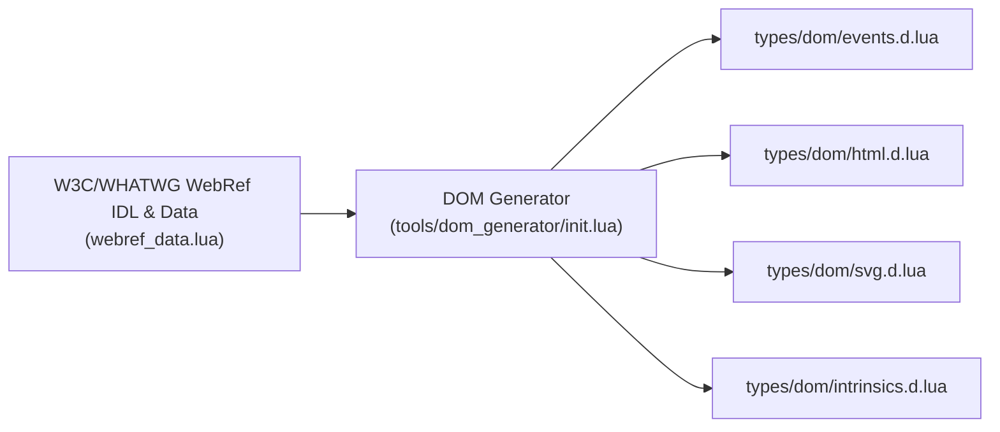

# Hydronium DOM Typing System & WebRef Generator

## 1. Overview

Hydronium provides an exhaustive, standards-compliant typing system for Web DOM elements, attributes, and synthetic events. These types are declared in pure EmmyLua / LuaCATS annotations under `types/dom/`:

- `types/dom/events.d.lua`: Synthetic event hierarchy and generic event handler signatures.
- `types/dom/html.d.lua`: HTML element attributes and global attribute schemas.
- `types/dom/svg.d.lua`: SVG element attributes and geometry primitives.
- `types/dom/intrinsics.d.lua`: Global intrinsic element signatures for LuaLS autocompletion.
- `types/luax.d.lua`: Core runtime ABI types (`HydroniumElement`, `HydroniumFragment`, `Component`).

These definitions are automatically generated from official **W3C / WHATWG WebRef** specifications using Hydronium's built-in generator (`tools/dom_generator/`).

---

## 2. WebRef DOM Generator Pipeline



### Running the Generator
The generator is implemented in pure Lua and can be executed via the CLI:
```bash
luax generate-dom
```
or via Lua:
```bash
luajit tools/dom_generator/init.lua
```

This ensures that whenever W3C specifications evolve, Hydronium's types can be regenerated with zero manual type-file editing.

---

## 3. Synthetic Event System

Hydronium provides a cross-platform, pooled synthetic event system modeled after the W3C DOM Level 3 Event specification. All synthetic events wrap native platform events and normalize browser inconsistencies.

### 3.1 Base `SyntheticEvent<T>`
Defined in `types/dom/events.d.lua`:
```lua
---@class SyntheticEvent<T>
---@field nativeEvent any The underlying platform event
---@field currentTarget T The element to which the event handler is attached
---@field target any The deepest element on which the event originated
---@field bubbles boolean Whether the event bubbles up through the tree
---@field cancelable boolean Whether the event can be cancelled
---@field defaultPrevented boolean Whether preventDefault() was invoked
---@field eventPhase number 1=CAPTURING, 2=AT_TARGET, 3=BUBBLING
---@field isTrusted boolean True if generated by a user action
---@field timeStamp number High-resolution timestamp
---@field type string Event type name (e.g., "click", "keydown")
---@field preventDefault fun(): void Cancels the event default action
---@field stopPropagation fun(): void Stops event bubbling
---@field stopImmediatePropagation fun(): void Stops sibling listeners
```

### 3.2 Specialized Synthetic Events

#### `SyntheticMouseEvent<T>`
```lua
---@class SyntheticMouseEvent<T> : SyntheticEvent<T>
---@field clientX number
---@field clientY number
---@field screenX number
---@field screenY number
---@field pageX number
---@field pageY number
---@field button number 0=Left, 1=Middle, 2=Right
---@field buttons number Bitmask of currently pressed mouse buttons
---@field altKey boolean
---@field ctrlKey boolean
---@field shiftKey boolean
---@field metaKey boolean
```

#### `SyntheticKeyboardEvent<T>`
```lua
---@class SyntheticKeyboardEvent<T> : SyntheticEvent<T>
---@field key string The value of the key pressed ("Enter", "a", "Escape")
---@field code string Physical key code ("KeyA", "Enter")
---@field repeat boolean True if key is being held down
---@field altKey boolean
---@field ctrlKey boolean
---@field shiftKey boolean
---@field metaKey boolean
```

#### `SyntheticFocusEvent<T>`
```lua
---@class SyntheticFocusEvent<T> : SyntheticEvent<T>
---@field relatedTarget any Secondary target element (for blur/focusout)
```

#### `SyntheticInputEvent<T>` & `SyntheticChangeEvent<T>`
```lua
---@class SyntheticInputEvent<T> : SyntheticEvent<T>
---@field data string? Inserted character or data
---@field inputType string Type of input edit ("insertText", "deleteContentBackward")
```

---

## 4. HTML Element Attributes

All HTML elements inherit from `HTMLGlobalAttributes`:

### 4.1 Global Attributes (`HTMLGlobalAttributes`)
```lua
---@class HTMLGlobalAttributes
---@field id? string
---@field class? string
---@field style? string | table<string, string | number>
---@field title? string
---@field tabIndex? number
---@field hidden? boolean
---@field autofocus? boolean
---@field accessKey? string
---@field contentEditable? boolean | '"true"' | '"false"'
---@field dir? '"ltr"' | '"rtl"' | '"auto"'
---@field lang? string
---@field role? string
---@field key? string | number
---@field ref? table | fun(node: any): void
---@field children? any
```

### 4.2 ARIA Attributes
Standard W3C ARIA attributes are typed directly on global attributes:
```lua
---@field ["aria-label"]? string
---@field ["aria-hidden"]? boolean | '"true"' | '"false"'
---@field ["aria-expanded"]? boolean | '"true"' | '"false"'
---@field ["aria-disabled"]? boolean | '"true"' | '"false"'
---@field ["aria-live"]? '"off"' | '"polite"' | '"assertive"'
---@field ["aria-current"]? boolean | '"page"' | '"step"' | '"location"' | '"date"' | '"time"'
---@field ["aria-haspopup"]? boolean | '"menu"' | '"listbox"' | '"tree"' | '"grid"' | '"dialog"'
```

### 4.3 Element-Specific Attribute Schemas

#### Button (`HTMLButtonAttributes`)
```lua
---@class HTMLButtonAttributes : HTMLGlobalAttributes
---@field type? '"button"' | '"submit"' | '"reset"'
---@field disabled? boolean
---@field name? string
---@field value? string
---@field form? string
---@field formAction? string
---@field onClick? fun(e: SyntheticMouseEvent<HTMLButtonElement>): void
```

#### Input (`HTMLInputAttributes`)
```lua
---@class HTMLInputAttributes : HTMLGlobalAttributes
---@field type? '"text"' | '"password"' | '"checkbox"' | '"radio"' | '"number"' | '"email"' | '"url"' | '"search"' | '"tel"' | '"file"' | '"hidden"'
---@field value? string | number
---@field checked? boolean
---@field placeholder? string
---@field required? boolean
---@field readOnly? boolean
---@field disabled? boolean
---@field maxLength? number
---@field minLength? number
---@field min? string | number
---@field max? string | number
---@field step? string | number
---@field onChange? fun(e: SyntheticChangeEvent<HTMLInputElement>): void
---@field onInput? fun(e: SyntheticInputEvent<HTMLInputElement>): void
```

#### Anchor (`HTMLAnchorAttributes`)
```lua
---@class HTMLAnchorAttributes : HTMLGlobalAttributes
---@field href? string
---@field target? '"_blank"' | '"_self"' | '"_parent"' | '"_top"' | string
---@field rel? string
---@field download? string | boolean
```

---

## 5. Strict Type Checking in LuaLS

Because all intrinsic tags are declared as typed constructors in `intrinsics.d.lua`, LuaLS performs strict static type checking in real time:

```luax
-- Example: Invalid attribute type triggers LuaLS diagnostic:
<button disabled="not-a-boolean">Click</button>
-- DIAGNOSTIC: Cannot assign 'string' to 'boolean | nil'

-- Example: Invalid union literal triggers LuaLS diagnostic:
<button type="primary">Click</button>
-- DIAGNOSTIC: Cannot assign '"primary"' to '"button" | "submit" | "reset" | nil'

-- Example: Typo in attribute name triggers LuaLS diagnostic:
<input pleceholder="Enter name" />
-- DIAGNOSTIC: Property 'pleceholder' does not exist on type 'HTMLInputAttributes'. Did you mean 'placeholder'?
```
