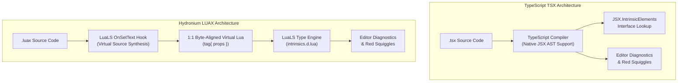

# Hydronium .luax vs JSX/TSX Comparative Architecture Audit

## 1. Executive Summary

Both **JSX/TSX** (developed for the ECMAScript/TypeScript ecosystem) and **LUAX** (developed for the Lua/LuaJIT ecosystem) enable declarative, component-based user interface authoring via embedded XML-like syntax. However, their design decisions, runtime ABIs, type systems, and compilation strategies diverge significantly due to the fundamental differences between Lua and JavaScript.

This audit provides a comprehensive comparison of syntax, compilation lowering, typing architectures, runtime overhead, and developer ergonomics between JSX/TSX and Hydronium `.luax`.

---

## 2. Feature & Syntax Comparison Matrix

| Feature | JSX / TSX (React, Solid) | Hydronium `.luax` | Architectural Rationale |
|---|---|---|---|
| **Host Language** | JavaScript / TypeScript | Lua 5.1–5.4, LuaJIT | Optimized for lightweight, embeddable scripting engines |
| **Expression Containers** | `{ expression }` (JS) | `{ expression }` (Lua) | Evaluates native host expressions inside markup |
| **Comment Syntax** | `{/* comment */}` | `{-- comment --}` | Aligns with Lua's native `--` comment syntax |
| **Boolean Attributes** | `<input disabled />` | `<input disabled />` | Lowers to `disabled = true` in both |
| **Dash-Attributes** | `aria-label="Save"` | `aria-label="Save"` | `.luax` compiler automatically quotes table keys: `["aria-label"] = "Save"` |
| **Spread Attributes** | `<div {...props} />` | `<div {...props} />` | Lowered via `__luax.spread(...)` left-to-right table merge |
| **Self-Closing Tags** | Optional for HTML void tags in HTML5 JSX; required in XHTML | Strictly required for all tags without children (`<input />`) | Eliminates hardcoded void-tag tables in the parser |
| **Component Tags** | Capitalized (`<Button />`) or member (`<UI.Button />`) | Capitalized (`<Button />`) or member (`<UI.Button />`) | Identical convention to distinguish components from intrinsics |
| **Fragments** | `<>...</>` or `<Fragment>...</>` | `<>...</>` | Group siblings without introducing DOM wrapper nodes |
| **Type Checking** | TypeScript compiler (`tsc`) via JSX namespaces | LuaLS via in-memory 1:1 Virtual Source projection | Leverages existing language server without requiring custom compiler forks |
| **Compilation Output** | `React.createElement` or `_jsx(tag, props)` | `__luax.element(tag, props)` | Lowered into pure Lua table constructors and VNodes |
| **Array Indexing** | 0-based (`items[0]`, `key={i}`) | 1-based (`items[1]`, `key={i}`) | Preserves Lua's 1-based indexing idiom |

---

## 3. Syntax & Idiom Comparison

### 3.1 Inline Anonymous Functions

#### TSX:
```tsx
<button onClick={(e) => handleClick(e.clientX)}>
    Click Me
</button>
```

#### LUAX:
```luax
<button onClick={function(e) handleClick(e.clientX) end}>
    Click Me
</button>
```
*Note*: In `.luax`, anonymous functions use standard Lua `function(e) ... end` syntax.

---

### 3.2 List Rendering & Keys

#### TSX:
```tsx
<ul>
    {users.map((user, idx) => (
        <li key={user.id}>{user.name} (#{idx})</li>
    ))}
</ul>
```

#### LUAX:
```luax
<ul>
    {users.map(function(user, idx)
        return <li key={user.id}>{user.name} (#{idx})</li>
    end)}
</ul>
```
*Note*: In Lua, `idx` starts at 1 by default.

---

### 3.3 Conditional Rendering

#### TSX:
```tsx
<div>
    {isLoggedIn ? <UserProfile user={user} /> : <LoginButton />}
    {hasAlerts && <AlertBanner count={alerts.length} />}
</div>
```

#### LUAX:
```luax
<div>
    {isLoggedIn and <UserProfile user={user} /> or <LoginButton />}
    {hasAlerts and <AlertBanner count={#alerts} /> or nil}
</div>
```
*Note*: Lua uses `cond and a or b` ternary simulation or `if-else` within helper closures. Falsy values (`nil`, `false`) are automatically discarded by the runtime.

---

## 4. Compilation & Lowering Comparison

### 4.1 Intrinsic Lowering

#### TSX (React 18 / Modern JSX Transform):
```js
// Input:
<div id="container" className="box"><span>Hello</span></div>

// Output:
import { jsx as _jsx, jsxs as _jsxs } from "react/jsx-runtime";
_jsxs("div", {
    id: "container",
    className: "box",
    children: _jsx("span", { children: "Hello" })
});
```

#### LUAX:
```lua
-- Input:
<div id="container" class="box"><span>Hello</span></div>

-- Output:
__luax.element("div", {
    id = "container",
    class = "box",
    children = {
        __luax.element("span", { children = { "Hello" } })
    }
})
```

### 4.2 Spread Attributes Lowering

#### TSX:
```js
// Input:
<button id="btn" {...props} className="active" />

// Output:
_jsx("button", Object.assign({ id: "btn" }, props, { className: "active" }));
```

#### LUAX:
```lua
-- Input:
<button id="btn" {...props} class="active" />

-- Output:
__luax.element("button", __luax.spread(
    { id = "btn" },
    props,
    { class = "active" }
))
```

---

## 5. Type System Architectures: TypeScript vs LuaLS



### Why Virtual Source Synthesis?
1. **No Language Server Forking**: TypeScript has hardcoded AST nodes for JSX (`JsxElement`, `JsxAttribute`). LuaLS has no native JSX grammar. By synthesizing a length-equivalent virtual Lua string, Hydronium runs on unmodified, upstream LuaLS.
2. **1:1 Coordinate Alignment**: Every character, token, and line matches the physical offset in the `.luax` file, delivering identical diagnostic and autocomplete precision to native TSX.

---

## 6. Migration Guide: From TSX to LUAX

For developers transitioning a React or Preact codebase to Hydronium `.luax`:

| React / TSX Pattern | Hydronium / LUAX Equivalent | Notes |
|---|---|---|
| `className="btn"` | `class="btn"` | `.luax` allows `class` directly (quoted in table) |
| `{/* comment */}` | `{-- comment --}` | Use Lua comment brackets |
| `items.length` | `#items` | Lua length operator |
| `array.map((x) => ...)` | `array.map(function(x) ... end)` | Standard Lua closures |
| `<input disabled={true} />` | `<input disabled />` or `<input disabled={true} />` | Boolean shorthand works identically |
| `style={{ color: "red" }}` | `style={{ color = "red" }}` | Use Lua `=` assignment for table keys |
| `` | `` | Self-closing slash is strictly required |
| `export default Comp` | `return Comp` | Standard Lua module return |
