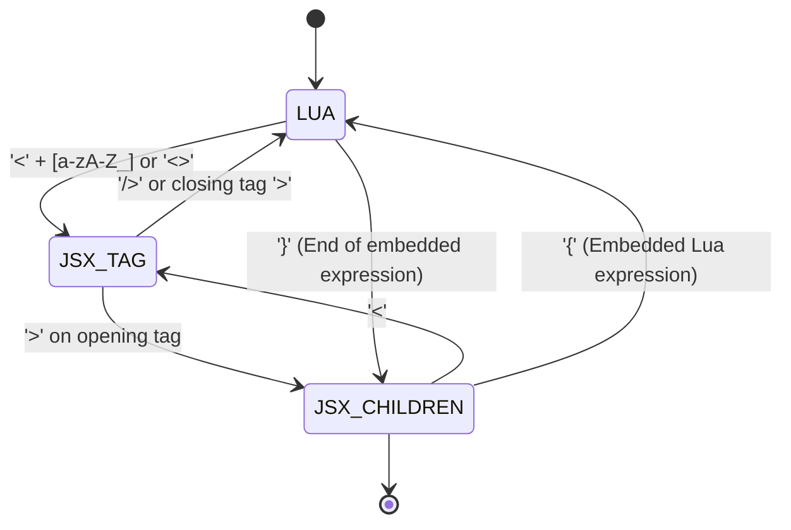

# Hydronium .luax Language Specification

## 1. Overview

**Hydronium `.luax`** is a syntax extension for the Lua language (compatible with Lua 5.1–5.4 and LuaJIT) that introduces first-class XML-like element expressions directly into Lua source code. Inspired by JSX/TSX in the ECMAScript ecosystem, `.luax` provides declarative, tree-structured markup for constructing UI component trees while preserving Lua's idioms, execution semantics, and runtime performance.

`.luax` files compile directly to standard, pure Lua files utilizing the Hydronium Runtime ABI (`__luax.element`, `__luax.fragment`, and `__luax.spread`).

---

## 2. Lexical Structure & Modal Lexer

Standard Lua lexers operate in a single parsing mode. In contrast, `.luax` requires a **modal, stateful lexer** that transitions between three distinct lexical modes:

1. **`LUA` Mode**: Standard Lua tokenization (identifiers, keywords, numbers, strings, operators, comments).
2. **`JSX_TAG` Mode**: Active inside element opening and closing tags (e.g., `<div class="hero">` or `</div>`).
3. **`JSX_CHILDREN` Mode**: Active inside the body of an element between opening and closing tags.



### 2.1 Lexical Modes Detail

- **`LUA`**:
  - Whitespace and standard Lua comments (`--` and `--[[ ... ]]`) are handled normally.
  - When encountering `<` immediately followed by an identifier character (`[a-zA-Z_]`) or `>` (for fragments `<>`), the lexer evaluates whether this is an element open or a comparison operator.
- **`JSX_TAG`**:
  - Tokens emitted include tag names, attribute names, `=` symbols, string literals (`"..."`, `'...'`), boolean shorthand flags, and tag delimiters (`>`, `/>`, `</`).
  - `{` enters an attribute expression container, switching temporarily to `LUA` mode until matching `}`.
- **`JSX_CHILDREN`**:
  - Plain text characters are collected into text tokens (`JSX_TEXT`).
  - XML entities (e.g., `&lt;`, `&amp;`, `&#39;`) are decoded into their UTF-8 equivalents.
  - `<` switches to `JSX_TAG` mode.
  - `{--` initiates an embedded JSX comment (`JSX_COMMENT`), skipping all characters until `--}`.
  - `{` enters an embedded Lua child expression container, switching to `LUA` mode until the matching `}`.

---

## 3. Disambiguation: `<tag` vs `a < b`

A classic ambiguity in embedding XML syntax inside programming languages is distinguishing the relational "less-than" operator (`<`, `<=`, `<<`) from the opening of an element (`<tag`):

```lua
local is_small = a < b
local is_valid = x < y and y > z
local elem = <button>Click</button>
```

The Hydronium lexer resolves this ambiguity deterministically through lexical lookahead and semantic context:

1. **Operator Precedence & Multi-char Tokens**:
   - `<<` is always tokenized as the bitwise shift operator `TK_SHL`.
   - `<=` is always tokenized as the less-or-equal operator `TK_LE`.
   - `<!--` is disallowed in `.luax` (use `{-- comment --}` instead).
2. **First Character After `<`**:
   - If `<` is followed by `>`, it is unambiguously a fragment opening `<>`.
   - If `<` is followed by `/`, it is a closing tag `</`.
   - If `<` is followed by whitespace, digits, parentheses, punctuation, or operators (e.g., `< 10`, `< (a + b)`), it is **unambiguously** the relational `<` operator.
3. **Identifier Lookahead**:
   - When `<` is immediately followed by `[a-zA-Z_]`, the lexer checks preceding tokens and statement boundaries. At expression start positions (e.g., after `=`, `return`, `(`, `{`, `,`, `and`, `or`, `not`), `<ident` is tokenized as an opening JSX tag.
   - Inside expressions where a comparison is syntactically expected and no statement separator has occurred, parenthesizing or standard spacing guarantees unambiguous parsing.

---

## 4. Elements & Tag Types

Hydronium `.luax` supports three distinct element categories:

### 4.1 Intrinsic Tags (Host / DOM Elements)

Intrinsic elements start with a lowercase ASCII letter. They map directly to host environment elements (such as HTML or SVG DOM nodes):

```luax
local view = (
    <div id="main" class="container">
        <span data-active="true">Hello Hydronium</span>
        <input type="text" placeholder="Search..." />
    </div>
)
```

**Hyphenated Elements**: Custom elements, web components, and host primitives containing hyphens (e.g., `<my-custom-element>`, `<color-picker>`) are fully supported as intrinsic tags.

### 4.2 Component Tags (User-Defined Functions / Tables)

Component elements start with an uppercase ASCII letter or contain dots. They represent callable Lua components (functions or callable tables with a `__call` metamethod):

```luax
local function Button(props)
    return <button class={props.variant}>{props.label}</button>
end

local view = <Button variant="primary" label="Submit" />
```

#### Dotted Component Paths

Components residing in nested tables or module namespaces use dot notation (`<Table.Member>`):

```luax
local UI = require("my_ui_library")

local modal = (
    <UI.Modal.Dialog isOpen={true}>
        <UI.Modal.Header title="Confirm" />
        <UI.Modal.Body>Are you sure?</UI.Modal.Body>
    </UI.Modal.Dialog>
)
```

### 4.3 Fragments (`<>...</>`)

Fragments allow grouping multiple child elements without injecting an unnecessary wrapper node into the host environment tree:

```luax
local function ListItems()
    return (
        <>
            <li>First</li>
            <li>Second</li>
            <li>Third</li>
        </>
    )
end
```

Fragments compile to `__luax.fragment(...)` at runtime.

---

## 5. Strict XML Well-Formedness

Unlike HTML5, `.luax` enforces **strict XML grammar**:

1. **Every Tag Must Close**: Every opened tag must either have a matching closing tag or be explicitly self-closing with `/>`.
2. **No Implicit Void Elements**: HTML void elements like ``, `<input>`, `<br>`, `<hr>`, and `<meta>` **must** be explicitly self-closing:
   ```luax
   -- Valid:
   <input type="checkbox" checked />
   
   <br />

   -- Compile Error (Unclosed tag):
   <input type="checkbox">
   
   ```
3. **Balanced Nesting**: Mismatched tags (e.g., `<div><span></div></span>`) trigger immediate compiler syntax errors detailing the expected closing tag, actual token, and source line/column coordinates.

---

## 6. Attributes & Props

Attributes are specified inside the opening tag:

### 6.1 String Literals

Values enclosed in double or single quotes:
```luax
<a href="https://hydronium.dev" target='_blank'>Docs</a>
```

### 6.2 Embedded Expressions

Lua expressions enclosed in `{ ... }`:
```luax
local count = 42
<span title={"Count: " .. count} data-count={count * 2} />
```

### 6.3 Boolean Shorthand

An attribute without an explicit value evaluates to boolean `true`:
```luax
<button disabled autofocus />
-- Equivalent to:
<button disabled={true} autofocus={true} />
```

### 6.4 Dash-Attributes (`aria-*`, `data-*`, custom)

HTML and SVG frequently use dashed attribute names (e.g., `aria-label`, `data-testid`, `stroke-width`). Because unquoted hyphens are subtraction operators in standard Lua table constructors, `.luax` automatically quotes hyphenated attributes in the emitted Lua table:

```luax
<button aria-label="Close" data-testid="modal-close-btn" />
-- Emitted Lua props table:
-- { ["aria-label"] = "Close", ["data-testid"] = "modal-close-btn" }
```

### 6.5 Spread Attributes (`{...props}`)

Attributes can be spread into an element from any Lua table:

```luax
local base_props = { class = "btn", ["aria-hidden"] = false }
local button = <button {...base_props} id="submit-btn" class="btn-primary" />
```

**Spread Semantics**:
- Attribute evaluation strictly proceeds **left-to-right**.
- Later attributes override earlier attributes with the same key. In the example above, `class="btn-primary"` overrides `class = "btn"` from `base_props`.
- Multiple spreads and explicit attributes can be interleaved seamlessly: `<div id="1" {...a} title="hi" {...b} />`.

---

## 7. Children

Elements can contain arbitrary numbers of child nodes between their opening and closing tags.

### 7.1 Text Children & Whitespace Rules

Plain text children are preserved with consistent whitespace normalization:
- Leading and trailing whitespace on lines within multiline elements is trimmed.
- Empty lines containing only whitespace are discarded.
- Consecutive spaces are collapsed to single spaces when adjacent to text content.

```luax
<div>
    Hello
    World
</div>
-- Child text is "Hello World"
```

### 7.2 XML Entity Decoding

`.luax` automatically decodes standard XML and HTML entities in text content:

| Entity | Decoded Character |
|---|---|
| `&lt;` | `<` |
| `&gt;` | `>` |
| `&amp;` | `&` |
| `&quot;` | `"` |
| `&apos;` / `&#39;` | `'` |
| `&#123;` | `{` (Decimal code point) |
| `&#x7D;` | `}` (Hexadecimal code point) |

```luax
<p>Use &lt;div&gt; &amp; &quot;quotes&quot;</p>
-- Text becomes: Use <div> & "quotes"
```

### 7.3 Embedded Expressions in Children

Enclose any valid Lua expression in `{ ... }`:

```luax
<div>
    <h1>{user.name}</h1>
    <p>Points: {user.score + 100}</p>
    <ul>
        {items.map(function(item)
            return <li key={item.id}>{item.title}</li>
        end)}
    </ul>
</div>
```

Valid child expression values:
- `nil` or `false`: Omitted from rendering (conditional rendering pattern: `{is_logged_in and <UserProfile /> or nil}`).
- Strings and numbers: Rendered as text nodes.
- Elements / VNodes: Rendered as child elements.
- Tables (arrays of elements): Flattened automatically.

### 7.4 Embedded Comments

Embedded comments inside JSX children use the `{-- ... --}` syntax:

```luax
<div>
    {-- This comment is stripped at compile time and produces zero output --}
    <span>Visible</span>
</div>
```

Standard Lua comments (`-- ...`) are also valid inside embedded expression containers:
```luax
<div>
    {
        -- This is a standard Lua comment inside an expression block
        user.name
    }
</div>
```

---

## 8. Complete Example

```luax
local Hydronium = require("hydronium")

local function UserCard(props)
    local user = props.user
    local is_online = user.status == "online"

    return (
        <article class={"card " .. (props.className or "")} data-testid="user-card">
            <header class="card-header">
                
                <h2 class="title">{user.name}</h2>
                <span class={"badge " .. (is_online and "badge-success" or "badge-muted")}>
                    {is_online and "Online" or "Offline"}
                </span>
            </header>
            
            <div class="card-body">
                {-- Bio section --}
                <p class="bio">{user.bio or "No bio provided."}</p>
                
                {user.badges and #user.badges > 0 and (
                    <ul class="badge-list" aria-label="User Badges">
                        {user.badges.map(function(badge)
                            return <li key={badge.id} class="badge-item">{badge.title}</li>
                        end)}
                    </ul>
                )}
            </div>

            <footer class="card-footer">
                <button
                    type="button"
                    class="btn btn-primary"
                    disabled={not is_online}
                    onClick={function(e)
                        print("Pinging " .. user.name .. " at timestamp " .. e.timeStamp)
                    end}
                >
                    Send Message
                </button>
            </footer>
        </article>
    )
end

return UserCard
```
