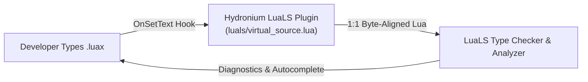

# Hydronium LuaLS Plugin & Virtual Source Architecture

## 1. Overview

Hydronium provides deep, native language intelligence for `.luax` files via the **LuaLS (Lua Language Server)** plugin system. Developers writing `.luax` receive:
- **Full Type Checking & Diagnostics**: Immediate detection of missing props, invalid attribute types, and misspellings.
- **Contextual Autocompletion**: Autocompleting HTML/SVG tag names, attribute names, ARIA attributes, and component prop tables.
- **Contextual Event Typing**: Automatic inference of event parameters (e.g., typing `e` as `SyntheticMouseEvent<HTMLButtonElement>` inside `onClick`).
- **Hover & Go to Definition**: Jump directly to component function definitions, prop type definitions, or DOM attribute specifications.
- **1:1 Coordinate Preservation**: Zero line or column drift between `.luax` files and the virtual source analyzed by LuaLS.

---

## 2. Virtual Source Synthesis (`OnSetText`)

LuaLS supports workspace plugins via an `OnSetText` hook. When a developer opens or edits a `.luax` file, Hydronium's LuaLS plugin intercepts the raw `.luax` text and synthesizes an in-memory **Virtual Lua Source** before LuaLS parses it.



### 2.1 The 1:1 LSP Coordinate Invariant

Language servers map diagnostics, hovers, and completion positions using zero-based or one-based line and column offsets. If the synthesized source shifts characters or lines:
- Red squiggly lines appear under the wrong words.
- Autocomplete popup triggers at offset coordinates.
- Go to Definition lands on wrong lines.

To solve this, Hydronium synthesizes virtual Lua that is **byte-for-byte length-equivalent** to the original `.luax` markup:

#### Intrinsic Tag Byte Alignment:
Consider the opening tag:
```luax
<button id="btn">
```
- Length of `<button `: **8 bytes**.
- Lowered to virtual call: `button{ `: **8 bytes**.
The `<` is replaced by the first character, and the closing space before attributes becomes the `{` constructor open, maintaining exact byte alignment.

#### Closing Tag Byte Alignment:
```luax
</button>
```
- Lowered to: `}      ` (closing brace followed by whitespace padding matching original length).

#### Self-Closing Tag Byte Alignment:
```luax
<input type="text" />
```
- Lowered to:
```lua
input{ type="text"  }
```
The `/>` (2 bytes) is replaced by ` }` (2 bytes).

---

## 3. Typed Call Projections & Contextual Event Typing

Hydronium lowers JSX elements into calls against strongly typed functions or global intrinsic tables declared in `types/dom/intrinsics.d.lua`:

### 3.1 Intrinsic Lowering in Virtual Source
```luax
-- Original .luax:
local view = (
    <button
        type="button"
        onClick={function(e)
            print(e.clientX, e.currentTarget)
        end}
    >
        Submit
    </button>
)
```

In the virtual source, this is projected to:
```lua
local view = (
    button{
        type = "button",
        onClick = function(e)
            print(e.clientX, e.currentTarget)
        end,
        children = {
            "Submit"
        }
    }
)
```

### 3.2 How Contextual Event Typing Works

In `types/dom/intrinsics.d.lua`, `button` is typed as:
```lua
---@param props HTMLButtonAttributes
---@return HydroniumElement
function button(props) end
```

And in `types/dom/html.d.lua`:
```lua
---@class HTMLButtonAttributes : HTMLGlobalAttributes
---@field type? '"button"' | '"submit"' | '"reset"'
---@field onClick? fun(e: SyntheticMouseEvent<HTMLButtonElement>): void
```

Because LuaLS analyzes the virtual source as a direct call to `button(...)`, it uses LuaLS's bidirectional type inference engine:
1. `onClick` in the table matches the field `HTMLButtonAttributes.onClick`.
2. The parameter `e` of the inline anonymous function `function(e)` is inferred to be `SyntheticMouseEvent<HTMLButtonElement>`.
3. Inside the function body, typing `e.` immediately autocompletes `clientX`, `clientY`, `altKey`, `button`, `preventDefault()`, `stopPropagation()`, and `currentTarget`.

---

## 4. Editor Configuration

### 4.1 Neovim (`nvim-lspconfig`)

In your Neovim configuration (e.g., `init.lua` or `lsp.lua`):

```lua
local lspconfig = require('lspconfig')

lspconfig.lua_ls.setup {
    settings = {
        Lua = {
            runtime = {
                version = 'LuaJIT',
                path = vim.split(package.path, ';'),
            },
            workspace = {
                library = {
                    -- Path to Hydronium type declarations
                    vim.fn.expand("~/.hydronium/types"),
                },
            },
            plugin = {
                enable = true,
                -- Absolute path to Hydronium LuaLS plugin
                path = vim.fn.expand("~/.hydronium/src/hydronium/luax/luals/init.lua"),
            },
            diagnostics = {
                globals = { "__luax" },
            },
        },
    },
}

-- Associate .luax with lua filetype
vim.filetype.add({
    extension = {
        luax = "luax",
    },
})
```

### 4.2 Visual Studio Code

Create or update `.vscode/settings.json` in your project root:

```json
{
    "files.associations": {
        "*.luax": "luax"
    },
    "Lua.workspace.library": [
        "${workspaceFolder}/types"
    ],
    "Lua.plugin.enable": true,
    "Lua.plugin.path": "${workspaceFolder}/src/hydronium/luax/luals/init.lua",
    "Lua.diagnostics.globals": [
        "__luax"
    ]
}
```

### 4.3 Workspace `.luarc.json`

Add a `.luarc.json` file in the root of your project:

```json
{
    "$schema": "https://raw.githubusercontent.com/LuaLS/vscode-lua/master/setting/schema.json",
    "runtime.version": "LuaJIT",
    "workspace.library": [
        "types"
    ],
    "plugin.enable": true,
    "plugin.path": "src/hydronium/luax/luals/init.lua",
    "diagnostics.globals": [
        "__luax"
    ]
}
```

---

## 5. Diagnostics & Verification

You can verify and type-check your `.luax` files from the command line using `luax check`:

```bash
luax check src/components/Button.luax
```

Expected diagnostic output when an error occurs:
```
[ERROR] src/components/Button.luax:14:9: Property 'onClik' does not exist on type 'HTMLButtonAttributes'. Did you mean 'onClick'?
```

### Common Troubleshooting:

| Issue | Cause | Solution |
|---|---|---|
| Red squiggles on `<tag>` | LuaLS plugin is not enabled | Verify `"Lua.plugin.enable": true` and `"Lua.plugin.path"` in settings |
| Unknown type `HTMLButtonAttributes` | Type definitions not loaded | Ensure `types` directory is listed in `Lua.workspace.library` |
| Drift in hover position | Virtual source length mismatch | Ensure you are using the latest version of `hydronium.luax.luals` |
