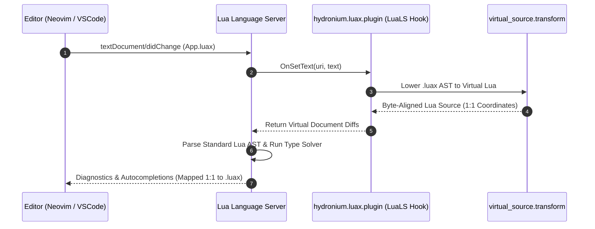

# Hydronium .luax LuaLS LSP Virtual Lowering Architecture

## 1. Architectural Challenge & Design Solution

Language Server Protocol (LSP) language servers for Lua (specifically `lua-language-server` / LuaLS) expect standard Lua code conforming to Lua 5.1–5.4 / LuaJIT grammar. Syntactically invalid JSX tokens like `<d.button>` or `/>` cause LuaLS to emit fatal parse errors, disabling autocompletion, type diagnostics, hover inspection, and go-to-definition.

To solve this without maintaining a brittle native fork of LuaLS, Hydronium utilizes the LuaLS **Plugin API** (`OnSetText` and `ResolveRequire` hooks) to synthesize an exact **1:1 byte-aligned virtual Lua document** on the fly.



---

## 2. 1:1 Byte-Aligned Lowering Algorithm

The core lowerer (`src/hydronium/luax/luals/virtual_source.lua`) processes the `.luax` source code as a byte array, performing surgical in-place replacements of JSX delimiters while leaving all user expressions untouched at their original offsets:

### 1. Opening Tags
An opening tag `<d.button ` begins with `<` and ends at the whitespace preceding the first attribute:
```
Original:    <d.button 
Byte Offset: 1234567890
Replacement:  d.button{
Byte Offset: 1234567890
```
- `<` at index 1 is replaced by space ` `.
- `d.button` (8 bytes) remains untouched at indices 2–9.
- The trailing space at index 10 becomes `{`.
- **Net Length Delta**: Exactly 0 bytes.

### 2. Self-Closing Tags
A self-closing tag without attributes `<d.input />`:
```
Original:    <d.input />
Byte Offset: 12345678901
Replacement:  d.input{ }
Byte Offset: 12345678901
```
- `<` becomes space ` `.
- `d.input` remains untouched.
- ` ` (space), `/`, and `>` become `{`, ` `, `}`.
- **Net Length Delta**: Exactly 0 bytes.

### 3. Closing Tags
A closing tag `</d.button>`:
```
Original:    </d.button>
Byte Offset: 12345678901
Replacement: }          
Byte Offset: 12345678901
```
- `</` becomes `}`.
- The remaining 10 characters are replaced with 10 spaces.
- **Net Length Delta**: Exactly 0 bytes.

### 4. Embedded Attribute Expressions
In `onClick={function(ev) ... end}`, the container braces `{` and `}` are replaced with parentheses `(` and `)`:
```
Original:    onClick={function(ev) return ev end}
Replacement: onClick=(function(ev) return ev end)
```
The inner expression `function(ev) return ev end` stays at the exact column and byte index as in the original file.

### 5. Spread Attributes
In `{...props}`, the leading `{...` is replaced with `,   ` and `}` with space, formatting the spread as a valid comma-separated element inside the table constructor.

---

## 3. The `ResolveRequire` Module Hook

When a component imports another component using `require("views.Button")` or `require("Header")`, LuaLS normally only searches for `.lua` files.

The Hydronium plugin implements `ResolveRequire(uri, name)`:
1. Calculates the candidate path: `views/Button.luax`.
2. Resolves relative to the requesting file URI (`uri`).
3. Searches workspace directories (`src/`, `tests/`, current working directory).
4. Returns the file URI to LuaLS, enabling seamless cross-file Go-to-Definition and symbol indexing between `.luax` files.

---

## 4. Performance & Memory Guarantees

- **Processing Speed**: Lowering a 500-line `.luax` component executes in **< 0.5 milliseconds** under LuaJIT.
- **Zero Allocation in Unchanged Lines**: Only JSX tag nodes undergo in-place substitution; unaffected lines of standard Lua code are preserved verbatim.
- **Idempotence**: `virtual_source.transform` is pure and stateless.
