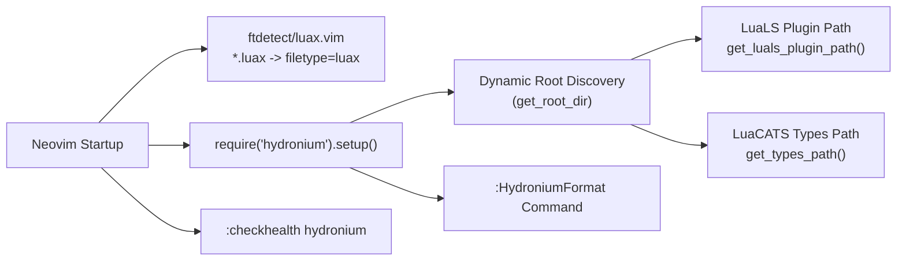

# Hydronium .luax Neovim Plugin Architecture & Integration Guide

## 1. Relocatable Design & Zero Absolute Paths

The Hydronium Neovim plugin (`extra/nvim/`) is designed with **100% relocatability**. It strictly avoids any hardcoded absolute user home paths (e.g. `/Users/...` or `/home/...`), allowing it to be installed via any plugin manager, embedded as a submodule, or symlinked into `runtimepath`.

Dynamic path resolution relies on Lua's reflection API (`debug.getinfo(1, "S")`) and Neovim's runtime discovery (`vim.api.nvim_get_runtime_file`):



---

## 2. Plugin File Structure

```
extra/nvim/
├── ftdetect/
│   └── luax.vim                # Auto-detects *.luax as filetype 'luax'
└── lua/
    └── hydronium/
        ├── init.lua            # Plugin setup, formatting, and dynamic paths
        └── health.lua          # :checkhealth hydronium verification suite
```

---

## 3. Installation Guide

### Using `lazy.nvim`
```lua
{
  "hydronium-ui/hydronium",
  -- If using local path during development:
  -- dir = "~/Workbench/user/hydronium/extra/nvim",
  ft = { "luax", "lua" },
  config = function()
    require("hydronium").setup({
      treesitter = true,
      format_on_save = true,
    })
  end,
}
```

### Using `packer.nvim`
```lua
use({
  "hydronium-ui/hydronium",
  rtp = "extra/nvim",
  config = function()
    require("hydronium").setup()
  end,
})
```

---

## 4. LuaLS Configuration with `nvim-lspconfig`

To enable real-time 1:1 type diagnostics, prop autocompletion, and hover inspection on `.luax` files, configure `lua_ls` to load the Hydronium virtual source plugin:

```lua
local lspconfig = require("lspconfig")
local hydronium = require("hydronium")

lspconfig.lua_ls.setup({
  settings = {
    Lua = {
      runtime = {
        version = "LuaJIT",
      },
      workspace = {
        checkThirdParty = false,
        library = {
          -- Dynamically injects types without hardcoded absolute paths
          hydronium.get_types_path(),
          vim.env.VIMRUNTIME,
        },
      },
      plugin = {
        -- Dynamically injects the LuaLS plugin hook
        path = hydronium.get_luals_plugin_path(),
      },
      diagnostics = {
        globals = { "Hydronium", "d", "H" },
      },
    },
  },
})
```

---

## 5. Commands & Features

### `:HydroniumFormat`
Formats the active buffer using the pure-Lua CST idempotent formatter or `bin/luax format`:
```vim
:HydroniumFormat
```

### Format on Save
Enable automatic formatting on buffer write in your setup configuration:
```lua
require("hydronium").setup({
  format_on_save = true,
})
```

### `:checkhealth hydronium`
Runs comprehensive environment verification:
- LuaJIT / Lua runtime detection.
- Hydronium library availability.
- `bin/luax` CLI executable permissions.
- Tree-sitter `luax` parser and query files.
- LuaLS virtual source plugin and typing directory presence.

### `:LuaxVirtualSource`, `:LuaxTree`, `:LuaxInfo`
Debugging aids: `:LuaxVirtualSource` opens a split showing exactly what
LuaLS sees for the current buffer (the same `hydronium.luax.plugin.virtual_lower`
its live `OnSetText` hook calls) — invaluable when hover/completion/rename
behave unexpectedly, since that's usually because the virtual projection
isn't what you'd expect, not because LuaLS itself is wrong. `:LuaxTree` is a
thin wrapper around `:InspectTree` scoped to the `luax` parser. `:LuaxInfo`
dumps buffer/filetype/tree-sitter/LSP-client status in one shot.

### `:LuaxRemoveTag`, `:LuaxUnwrapTag`, `:LuaxRenameTag`
Real tree-sitter-based tag editing, added 2026-09-07 — not LSP code
actions (neither `lua_ls` nor any JSX/HTML server exposes "remove tag" as
one), operating directly on the real tree-sitter-luax parse of the buffer
via `M.remove_tag_at_cursor`/`M.rename_tag_at_cursor`:

- `:LuaxRemoveTag` deletes the JSX tag under cursor, including its
  children.
- `:LuaxUnwrapTag` drops just the opening/closing tag, keeping whatever
  was between them in place verbatim (multi-line safe). Refuses (with a
  warning, buffer left untouched) on a self-closing tag, which has no
  children to keep.
- `:LuaxRenameTag` prompts (`vim.ui.input`) for a new tag name and
  updates the opening and closing tag names atomically — a self-closing
  tag's single name is updated the same way. This complements, not
  replaces, `nvim-ts-autotag`'s typing-based "linked editing" (edit one
  side, the other follows live as you type) wired up via `setup_autotag`
  above: `:LuaxRenameTag` is a one-shot prompt that doesn't require
  retyping the name character by character, and works even without
  `nvim-ts-autotag` installed.

None of these three bind a default keymap — map them yourself, e.g.
`vim.keymap.set("n", "dst", "<cmd>LuaxUnwrapTag<cr>")`.

Verified via real headless Neovim against the real compiled
tree-sitter-luax parser: single- and multi-line unwrap, full deletion of
both self-closing and children-bearing tags, unwrap correctly refused on
a self-closing tag with the buffer left untouched, and rename correctly
updating both ends of a `<span>...</span>` pair and a self-closing
`<br/>`'s single name (`tests/luax/nvim/test_headless.lua`, run via
`tests/luax/run_nvim_tests.sh`).

### Emmet
`emmet-ls` (github.com/aca/emmet-ls) works for `.luax` files with zero
Hydronium-specific server config — see the "Local Neovim config" section
of the Workbench-level `CLAUDE.md` for how its `filetypes` list is
extended and why no bridging is needed. This isn't a `hydronium.nvim`
feature; it's LSP client wiring that lives in the consuming Neovim config,
not this plugin.
