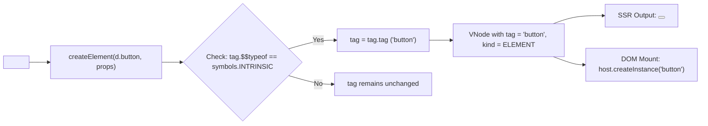

# Hydronium .luax Tag Semantics & Descriptor Architecture

## 1. Tag Semantics Overview

Hydronium `.luax` classifies JSX tags into three distinct semantic categories:
1. **Lexical Intrinsic Descriptors (`<d.button>`, `<d.input>`)**: Intrinsic host elements referenced explicitly through a scoped descriptor table `d`.
2. **Standard Host Intrinsics (`<button>`, `<input>`)**: Unprefixed tags resolved through the active compilation environment schema.
3. **Custom Components (`<UserProfile>`, `<UI.Card>`)**: Lua functions, callable tables, or context providers.

---

## 2. The `d` Descriptor Protocol

### Anatomy of an Intrinsic Descriptor
Each intrinsic descriptor is an immutable Lua table structured as follows:

```lua
local button_descriptor = setmetatable({
  ["$$typeof"] = symbols.INTRINSIC,
  _typeof = symbols.INTRINSIC,
  tag = "button",
  host = "dom",
}, {
  __call = function(self, props, ...)
    return elementModule.createElement(self, props, ...)
  end,
  __tostring = function(self)
    return "Hydronium.DOM.Intrinsic(" .. (self.tag or "intrinsic") .. ")"
  end,
  __newindex = function(_, k, _)
    error("Cannot modify immutable intrinsic descriptor property: " .. tostring(k), 2)
  end,
})
```

### Properties of the Descriptor:
- **`$$typeof`**: Unique Hydronium symbol (`symbols.INTRINSIC`) identifying this object as a host element descriptor.
- **`tag`**: The canonical lowercase tag name string (e.g., `"button"`, `"input"`, `"path"`).
- **`host`**: The target host environment namespace (`"dom"`).
- **Callable Metamethod (`__call`)**: Invoking `d.button(props, ...)` forwards directly to `element.createElement(self, props, ...)`.
- **Immutability**: Metatable forbids mutation, preventing accidental monkey-patching in multi-tenant environments.

---

## 3. Core Normalization & Unwrapping Mechanics

When an element is instantiated via `createElement`, rendered on the server, or reconciled against host nodes, the descriptor is unwrapped:



### 1. Element Factory (`src/hydronium/core/element.lua`)
```lua
local resolvedTag = tag
if type(tag) == "table" and (tag["$$typeof"] == symbols.INTRINSIC or tag._typeof == symbols.INTRINSIC) then
  resolvedTag = tag.tag
end
```
By unwrapping before determining `kind`, `d.button` resolves directly to `symbols.ELEMENT` with `node.tag = "button"`.

### 2. Server Renderer (`src/hydronium/server/init.lua`)
```lua
local node_tag = node.tag
if type(node_tag) == "table" and (node_tag["$$typeof"] == symbols.INTRINSIC or node_tag._typeof == symbols.INTRINSIC) then
  node_tag = node_tag.tag
end
```
Unwrapping before checking `type(node_tag) == "function" or callable table` ensures `d.button` is never erroneously evaluated as a functional component, but is directly formatted as `<button...></button>`.

### 3. DOM Reconciler (`src/hydronium/core/reconciler.lua`)
```lua
local function unwrapTag(tag)
  if type(tag) == "table" and (tag["$$typeof"] == symbols.INTRINSIC or tag._typeof == symbols.INTRINSIC) then
    return tag.tag
  end
  return tag
end

function Reconciler:canReuse(oldVNode, newVNode)
  return oldVNode.kind == newVNode.kind
    and unwrapTag(oldVNode.tag) == unwrapTag(newVNode.tag)
    and oldVNode.key == newVNode.key
end
```
Both `d.button` and `"button"` resolve to identical string tags, allowing seamless interoperability between direct descriptor trees and bare-tag VNodes.

---

## 4. Void Element Semantics

Hydronium strictly enforces HTML5 void element semantics during both compilation and server-side rendering:
- **Void Tags**: `area`, `base`, `br`, `col`, `embed`, `hr`, `img`, `input`, `link`, `meta`, `param`, `source`, `track`, `wbr`.
- **Zero Children Rule**: Supplying children to a void element (`<d.input>child</d.input>`) raises an immediate runtime error (`Void element <input> cannot have children`).
- **Self-Closing Normalization**: In `.luax` templates, void elements must be written with XML-strict self-closing syntax (`<d.input />`). In SSR output, they are rendered according to HTML5 standard void syntax (`<input ...>`).
