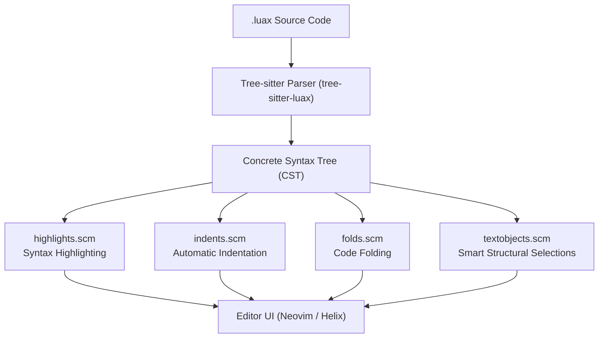

# Hydronium .luax Tree-sitter Grammar & Query Architecture

## 1. Tree-sitter Overview & Design Rationale

Tree-sitter provides high-performance, incremental parsing directly inside modern text editors (such as Neovim and Helix). For Hydronium `.luax`, Tree-sitter provides:
- **Instantaneous syntax highlighting** that updates per keystroke in sub-millisecond time.
- **Robust error recovery** when users are typing unclosed tags (e.g., `<d.` or `<button `).
- **Accurate indentation** for JSX elements, multi-line attributes, and table constructors.
- **Structural code folding** and **semantic textobjects** (`vai` to select inside an element, `daa` to delete an attribute).



---

## 2. Grammar Rules & AST Structure (`tree-sitter-luax/grammar.js`)

The grammar cleanly extends standard Lua 5.1–5.4 with the following JSX-specific nodes:

### 1. Elements (`element_expression`)
Represents a paired or self-closing JSX element:
```javascript
element_expression: $ => choice(
  seq(
    field('open', $.opening_element),
    repeat($._child),
    field('close', choice($.closing_element, $._error_recovery))
  ),
  $.self_closing_element
)
```

### 2. Tags (`tag_expression`)
Supports identifiers, dotted member expressions, and hyphenated tags:
```javascript
tag_expression: $ => prec.left(choice(
  $.identifier,
  $.dotted_identifier,
  $.hyphenated_identifier
))

dotted_identifier: $ => prec.left(seq(
  field('object', choice($.identifier, $.dotted_identifier)),
  '.',
  field('property', $.identifier)
))
```
This allows `<d.button>`, `<UI.Card.Header>`, and `<my-custom-element>` to parse into distinct AST structures with separate fields for namespaces and tags.

### 3. Attributes & Spreads (`attribute`, `spread_attribute`)
```javascript
attribute: $ => seq(
  field('name', choice($.identifier, $.hyphenated_identifier)),
  optional(seq('=', field('value', choice($.string, $.number, $.boolean, $._expression_container))))
)

spread_attribute: $ => seq('{', '...', field('value', $.expression), '}')
```

### 4. Fragments (`fragment`)
```javascript
fragment: $ => choice(
  seq(
    field('open', $.opening_fragment),
    repeat($._child),
    field('close', choice($.closing_fragment, $._error_recovery))
  ),
  $.self_closing_fragment
)
```

---

## 3. Resilient Error Recovery Strategy

During interactive editing, developers frequently pause while typing incomplete code:
1. Typing a tag name: `<d.`
2. Typing attributes: `<button class="btn" `
3. Typing expressions: `<button onClick={`

Without error recovery rules, the parser would reject the entire enclosing function or file.

`tree-sitter-luax` introduces a low-precedence error recovery rule:
```javascript
_error_recovery: $ => prec(-2, choice(
  seq('<', choice($.identifier, $.dotted_identifier)),
  seq('<', '/'),
  '<'
))
```
When an unclosed tag is encountered, Tree-sitter absorbs the partial prefix into `_error_recovery`, synchronizes to the next delimiter, and continues parsing the remainder of the file with full syntax highlighting.

---

## 4. Query System Architecture (`queries/luax/`)

### Highlights (`highlights.scm`)
Maps CST nodes to Neovim / Tree-sitter standard captures:
- `@tag.delimiter`: `<` `>` `</` `/>`
- `@tag`: Element tag names (`button`, `div`)
- `@module.builtin`: Descriptor namespace (`d` in `d.button`)
- `@tag.attribute`: Attribute names (`class`, `onClick`, `id`)
- `@operator`: Spread operator `...`
- `@comment`: Embedded JSX comments `{-- comment --}`

### Indents (`indents.scm`)
Assigns `@indent.begin` to `element_expression`, `fragment`, and `opening_element`, and `@indent.end` to `closing_element` and `closing_fragment`. Attributes receive `@indent.align` for canonical multi-line formatting.

### Folds (`folds.scm`)
Collapses multi-line elements, fragments, functions, and block comments when running Neovim's fold commands (`zc`, `zo`, `za`).

### Textobjects (`textobjects.scm`)
Defines targets for structural editor motions:
- `@element.outer`: The entire tag tree including open, children, and close.
- `@element.inner`: Just the children nodes between tags.
- `@attribute.outer`: The attribute key and value.
- `@attribute.inner`: The attribute value expression.
- `@tag.outer`: The opening or closing tag delimiters and name.
