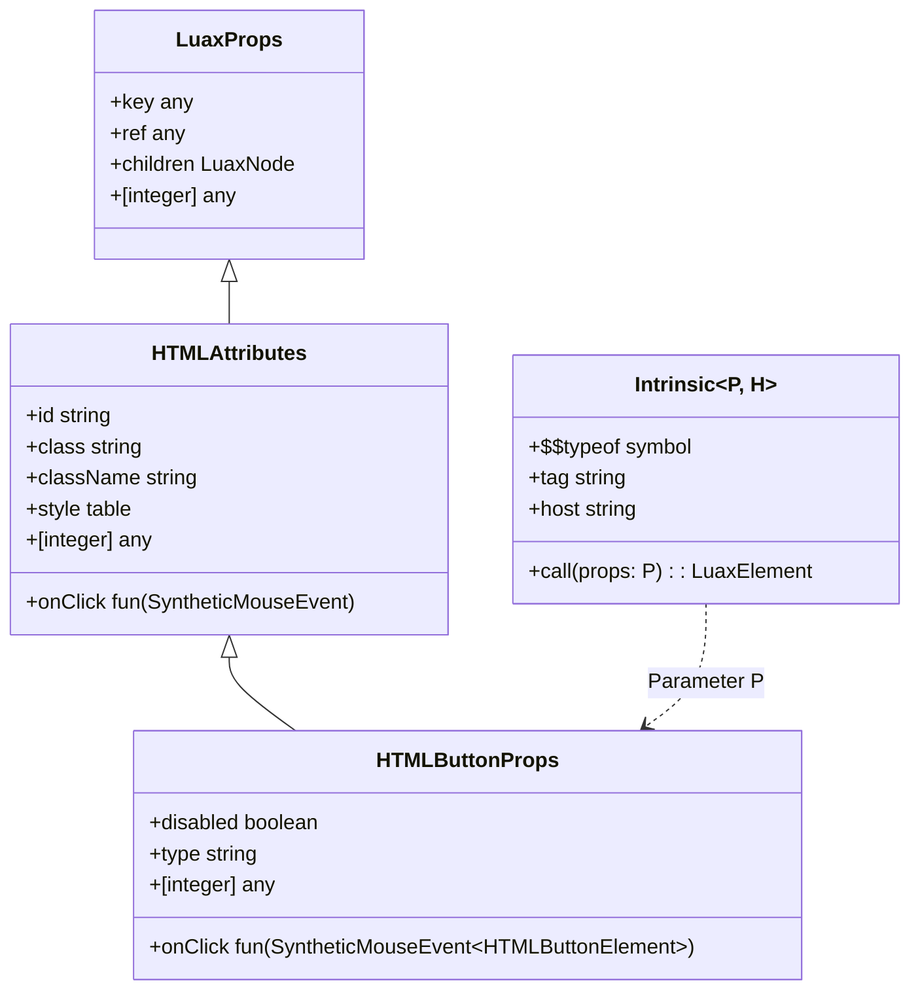

# Hydronium .luax LuaCATS Typing System

## 1. LuaCATS Type Architecture

The Hydronium typing system is written in standard LuaCATS / EmmyLua annotations (`---@class`, `---@alias`, `---@generic`, `---@overload`). It provides static type safety, prop autocomplete, and contextual parameter inference inside IDEs running LuaLS, without requiring transpilation or auxiliary build steps.



---

## 2. Core Declarations (`types/luax.d.lua`)

### 1. `hydronium.Intrinsic<P, H>`
Represents a callable intrinsic descriptor with generic props `P` and host element type `H`:
```lua
---@class hydronium.Intrinsic<P, H>
---@field ["$$typeof"] any
---@field tag string
---@field host string
---@overload fun(props?: P, ...: any): LuaxElement
```

### 2. `hydronium.ElementType<P, H>`
Unifies intrinsic descriptors, functional components, and string tags:
```lua
---@alias hydronium.ElementType<P, H> hydronium.Intrinsic<P, H> | (fun(props: P): LuaxNode) | string
```

### 3. `__luax_element`
Lowering helper for LuaLS type-checking:
```lua
---@generic P, H
---@param tag hydronium.ElementType<P, H>
---@param props? P
---@param ... any
---@return LuaxElement
function __luax_element(tag, props, ...) end
```

---

## 3. DOM Descriptor Catalog (`types/dom/init.d.lua`)

The `d` descriptor table is typed with all standard HTML and SVG element signatures:

```lua
---@class HydroniumDOMDescriptors
---@field d HydroniumDOMDescriptors
---@field button hydronium.Intrinsic<HTMLButtonProps, HTMLButtonElement>
---@field input hydronium.Intrinsic<HTMLInputProps, HTMLInputElement>
---@field h1 hydronium.Intrinsic<HTMLHeadingProps, HTMLHeadingElement>
---@field div hydronium.Intrinsic<HTMLDivProps, HTMLDivElement>
---@field span hydronium.Intrinsic<HTMLSpanProps, HTMLSpanElement>
---@field a hydronium.Intrinsic<HTMLAnchorProps, HTMLAnchorElement>
---@field p hydronium.Intrinsic<HTMLParagraphProps, HTMLParagraphElement>
---@field form hydronium.Intrinsic<HTMLFormProps, HTMLFormElement>
---@field svg hydronium.Intrinsic<SVGSVGProps, SVGElement>
---@field path hydronium.Intrinsic<SVGPathProps, SVGElement>
```

When authoring `<d.button onClick={...}>`, LuaLS resolves `d.button` to `hydronium.Intrinsic<HTMLButtonProps, HTMLButtonElement>`.

---

## 4. Mixed Table Support in Props

In Lua, templates frequently pass both named attributes and array child nodes inside the table literal:
```lua
d.button { id = "save", "Click Me" }
```
In standard strict typing systems, passing numerical keys into a table typed with named string keys generates `unexpected-index` warnings.

To solve this, Hydronium defines mixed table indexing across all prop classes:
```lua
--- Standard HTML attributes shared across all elements
---@class HTMLAttributes : LuaxProps, { [integer]: any }
---@field [integer] any

--- Props for <button> element
---@class HTMLButtonProps : HTMLAttributes, { [integer]: any }
---@field [integer] any
---@field disabled boolean?
---@field onClick? fun(event: SyntheticMouseEvent<HTMLButtonElement>): void
```
This guarantees zero diagnostic noise when passing children inline while retaining strict type checking for named attributes.

---

## 5. Event Hierarchy & Contextual Callback Inference

Hydronium models the W3C DOM event hierarchy as generic classes inheriting from `SyntheticEvent<T>`:

- `SyntheticEvent<T>`: Base event with `target: T`, `currentTarget: T`, `preventDefault()`, `stopPropagation()`.
- `SyntheticMouseEvent<T>`: `clientX`, `clientY`, `button`, `altKey`, `ctrlKey`, `metaKey`, `shiftKey`.
- `SyntheticKeyboardEvent<T>`: `key`, `code`, `repeat`.
- `SyntheticFocusEvent<T>`: `relatedTarget`.
- `SyntheticChangeEvent<T>`: `value`.

Because element props declare element-specific event signatures (`onClick?: fun(event: SyntheticMouseEvent<HTMLButtonElement>): void`), LuaLS contextually infers callback parameter types:

```lua
<d.button onClick={function(ev)
  -- ev is automatically typed as SyntheticMouseEvent<HTMLButtonElement>
  print(ev.clientX, ev.target.disabled)
end} />
```
Hovering over `ev` reveals its complete type signature, and autocomplete suggests all available mouse event properties without manual type casting.
