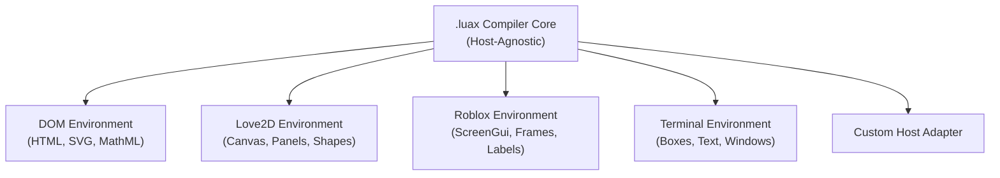

# Hydronium Schema Provider & Type Environment Protocol (`Environment<I>`)

## 1. Architectural Philosophy: Zero Hardcoded Tags

A common architectural flaw in JSX/TSX compilers is hardcoding HTML5 and SVG tag vocabularies directly into the parser or code generator. This ties the language to the web browser DOM and makes targeting non-DOM environments (game engines, terminal UIs, mobile frameworks, native renderers) difficult and unnatural.

Hydronium `.luax` completely decouples syntax parsing from any specific rendering target.
- **The compiler core has ZERO hardcoded HTML/SVG tag names.**
- All intrinsic tag rules, attribute schemas, and type-checking definitions are provided via the **Environment Protocol (`Environment<I>`)**.
- The same compiler compiles `.luax` for web browsers, Love2D, Defold, Roblox, Raylib, or terminal UIs.



---

## 2. The `Environment<I>` Interface

An Environment Provider in Hydronium implements the following schema interface:

```lua
---@class Environment
---@field name string Identifier for the environment (e.g., "dom", "love2d", "roblox")
---@field is_intrinsic fun(tag_name: string): boolean Returns true if tag_name is an intrinsic host element
---@field get_attributes fun(tag_name: string): table<string, AttributeSchema> Returns schema of allowed attributes
---@field get_event_type fun(tag_name: string, event_name: string): string? Returns EmmyLua/LuaLS event type name
---@field get_vnode_factory fun(): string Returns the runtime require path for the environment's VNode factory
```

### Attribute Schema Structure:
```lua
---@class AttributeSchema
---@field type "string" | "number" | "boolean" | "function" | "table" | "any"
---@field required boolean
---@field description? string
```

---

## 3. Built-In & Standard Environments

### 3.1 Web DOM Environment (`types/dom/`)
Targets standard web browsers, Electron, Tauri, and CEF:
- **Intrinsics**: `div`, `span`, `p`, `button`, `input`, `form`, `svg`, `path`, `canvas`, etc.
- **Attributes**: `id`, `class`, `style`, `disabled`, `value`, `href`, `aria-*`, `data-*`.
- **Event Types**: `SyntheticMouseEvent<T>`, `SyntheticKeyboardEvent<T>`, `SyntheticFocusEvent<T>`, etc.

```luax
-- DOM Environment example:
<div class="card" aria-hidden="false">
    <button onClick={function(e) e:preventDefault() end}>Click</button>
</div>
```

### 3.2 Love2D Environment (`types/love2d/`)
Targets the Love2D 2D game engine:
- **Intrinsics**: `window`, `canvas`, `panel`, `text`, `sprite`, `rect`, `circle`.
- **Attributes**: `x`, `y`, `width`, `height`, `color`, `scale`, `rotation`, `blend_mode`.
- **Event Types**: `LovePointerEvent`, `LoveKeyEvent`.

```luax
-- Love2D Environment example:
<panel x={100} y={100} width={400} height={300} color={0.1, 0.1, 0.1, 1}>
    <rect x={10} y={10} width={100} height={40} color={0.2, 0.6, 1.0, 1} />
    <text x={20} y={20} value="Start Game" font="header" />
</panel>
```

### 3.3 Roblox Environment (`types/roblox/`)
Targets Roblox Luau / Engine:
- **Intrinsics**: `screengui`, `frame`, `textlabel`, `imagebutton`, `textbox`, `uilistlayout`.
- **Attributes**: `Size`, `Position`, `BackgroundColor3`, `Text`, `TextColor3`, `ZIndex`.
- **Event Types**: `InputBegan`, `MouseButton1Click`.

```luax
-- Roblox Environment example:
<frame Size={UDim2.new(0, 300, 0, 200)} BackgroundColor3={Color3.fromRGB(30, 30, 30)}>
    <textlabel Text="Roblox Luax Window" Size={UDim2.new(1, 0, 0, 30)} />
    <imagebutton Image="rbxassetid://12345" />
</frame>
```

### 3.4 Terminal UI (TUI) Environment (`types/tui/`)
Targets console applications using ANSI escapes or Termbox:
- **Intrinsics**: `screen`, `box`, `text`, `border`, `hstack`, `vstack`.
- **Attributes**: `fg`, `bg`, `bold`, `width`, `height`, `title`, `align`.

```luax
-- TUI Environment example:
<box width={80} height={24} border="single" title="System Monitor">
    <text fg="cyan">CPU Usage: 42%</text>
    <text fg="green">RAM: 3.2 GB / 16 GB</text>
</box>
```

---

## 4. Creating a Custom Host Adapter

To target a new graphics library, GUI framework, or embedded display, follow these three steps:

### Step 1: Implement the Environment Definition (`my_host_env.lua`)
```lua
local MyHostEnv = {}
MyHostEnv.name = "myhost"

local INTRINSICS = {
    view = true,
    label = true,
    button = true,
    image = true,
}

function MyHostEnv.is_intrinsic(tag)
    return INTRINSICS[tag] == true
end

function MyHostEnv.get_vnode_factory()
    return "myhost.runtime.element"
end

return MyHostEnv
```

### Step 2: Generate EmmyLua / LuaLS Typing (`types/myhost/intrinsics.d.lua`)
Write the type definitions so LuaLS provides instant autocompletion:

```lua
---@meta

---@class MyHostViewProps
---@field x? number
---@field y? number
---@field visible? boolean
---@field children? HydroniumElement[]

---@class MyHostButtonProps : MyHostViewProps
---@field text string
---@field onClick? fun(e: MyHostClickEvent): void

---@param props MyHostViewProps
---@return HydroniumElement
function view(props) end

---@param props MyHostButtonProps
---@return HydroniumElement
function button(props) end
```

### Step 3: Configure Project Environment
In your `.luarc.json` or compiler CLI:
```json
{
    "workspace.library": [
        "types/myhost"
    ]
}
```

```bash
luax compile src/App.luax --env=myhost
```

By leveraging the `Environment<I>` protocol, your application codebase gains 100% type safety and zero compiler modifications across any platform.
