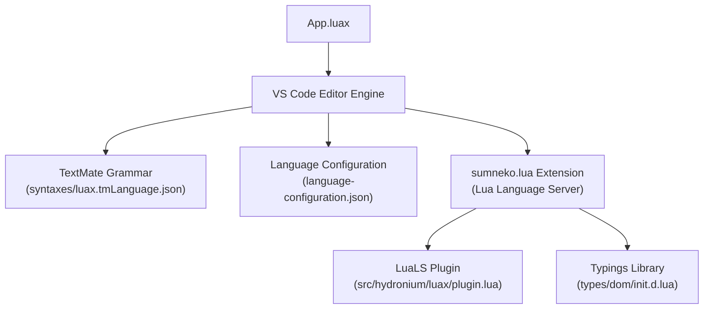

# Hydronium .luax Visual Studio Code Integration Guide

> **2026-09-06 correction**: prior to this note, there was no `package.json`
> extension manifest anywhere in this repo — `syntaxes/luax.tmLanguage.json`
> and `language-configuration.json` existed but nothing declared them as a
> VS Code language/grammar contribution, so `files.associations: {"*.luax":
> "luax"}` (§4 below) would have mapped to a language VS Code had never
> heard of. A minimal `package.json` at the repo root now registers `luax`
> as a language and wires both files in via `contributes.languages`/
> `contributes.grammars`, so the extension is at least structurally
> installable (e.g. via "Developer: Install Extension from Location..." or
> `vsce package`). **This was not verified in a running VS Code instance —
> no `code` CLI was available in the environment this fix was made in.**
> Treat this section's other claims with the same caution as the rest of
> `docs/` per `LUAX_DX_CURRENT_STATE.md` until someone actually opens a
> `.luax` file in real VS Code and checks.

## 1. VS Code Architecture Overview

Hydronium provides comprehensive Visual Studio Code editor support through standard extension configuration:
1. **TextMate Grammar (`syntaxes/luax.tmLanguage.json`)**: Rich syntax highlighting with dedicated scopes for dotted tags (`d.button`, `UI.Button`), attributes, and embedded Lua expressions.
2. **Language Configuration (`language-configuration.json`)**: Bracket matching, automatic closing pairs, comment toggling (`--` and `{-- --}`), and indentation rules.
3. **Lua Language Server (LuaLS) Integration**: Connects with the standard `sumneko.lua` extension to provide 1:1 type safety, autocomplete, and diagnostics.



---

## 2. Dotted Tag TextMate Scopes

The TextMate grammar distinguishes namespace qualifiers, accessors, and element names:

```json
{
  "name": "meta.tag.open.dotted.luax",
  "begin": "(<\\s*)([a-zA-Z_][a-zA-Z0-9_]*)(\\.)([a-zA-Z_][a-zA-Z0-9_\\-]*)",
  "beginCaptures": {
    "1": { "name": "punctuation.definition.tag.begin.luax" },
    "2": { "name": "support.class.builtin.luax" },
    "3": { "name": "punctuation.accessor.luax" },
    "4": { "name": "entity.name.tag.luax" }
  }
}
```

- In `<d.button>`:
  - `<` receives `punctuation.definition.tag.begin.luax`
  - `d` receives `support.class.builtin.luax`
  - `.` receives `punctuation.accessor.luax`
  - `button` receives `entity.name.tag.luax`
- In `<UI.Card>`:
  - `UI` receives `support.class.builtin.luax`
  - `.` receives `punctuation.accessor.luax`
  - `Card` receives `entity.name.tag.luax`

---

## 3. Language Configuration (`language-configuration.json`)

Provides native editor behaviors:
- **Auto-Closing Pairs**: Auto-closes `<` with `>`, `{` with `}`, `"` with `"`.
- **Comments**:
  - Line comment: `--`
  - Block comment: `--[[ ... ]]`
- **Indentation Rules**: Automatically indents after unclosed JSX elements and `function` / `then` / `do` blocks; unindents on `end`, `</tag>`, `/>`, `}`.

---

## 4. Workspace Configuration (`.vscode/settings.json`)

To enable full type checking and autocompletion in VS Code with the `sumneko.lua` extension:

```json
{
  "files.associations": {
    "*.luax": "luax"
  },
  "Lua.runtime.version": "LuaJIT",
  "Lua.workspace.checkThirdParty": false,
  "Lua.workspace.library": [
    "${workspaceFolder}/types"
  ],
  "Lua.plugin.path": "${workspaceFolder}/src/hydronium/luax/plugin.lua",
  "Lua.diagnostics.globals": [
    "Hydronium",
    "d",
    "H"
  ]
}
```

With these settings active:
- Typing `<d.` triggers autocomplete listing all HTML5 and SVG elements (`button`, `input`, `div`, `span`, `svg`, etc.).
- Passing props contextually autocompletes valid attributes (e.g. `disabled`, `type`, `onClick`).
- Event parameters (`onClick={function(ev) ... end}`) infer `SyntheticMouseEvent` methods and fields without manual type annotations.
