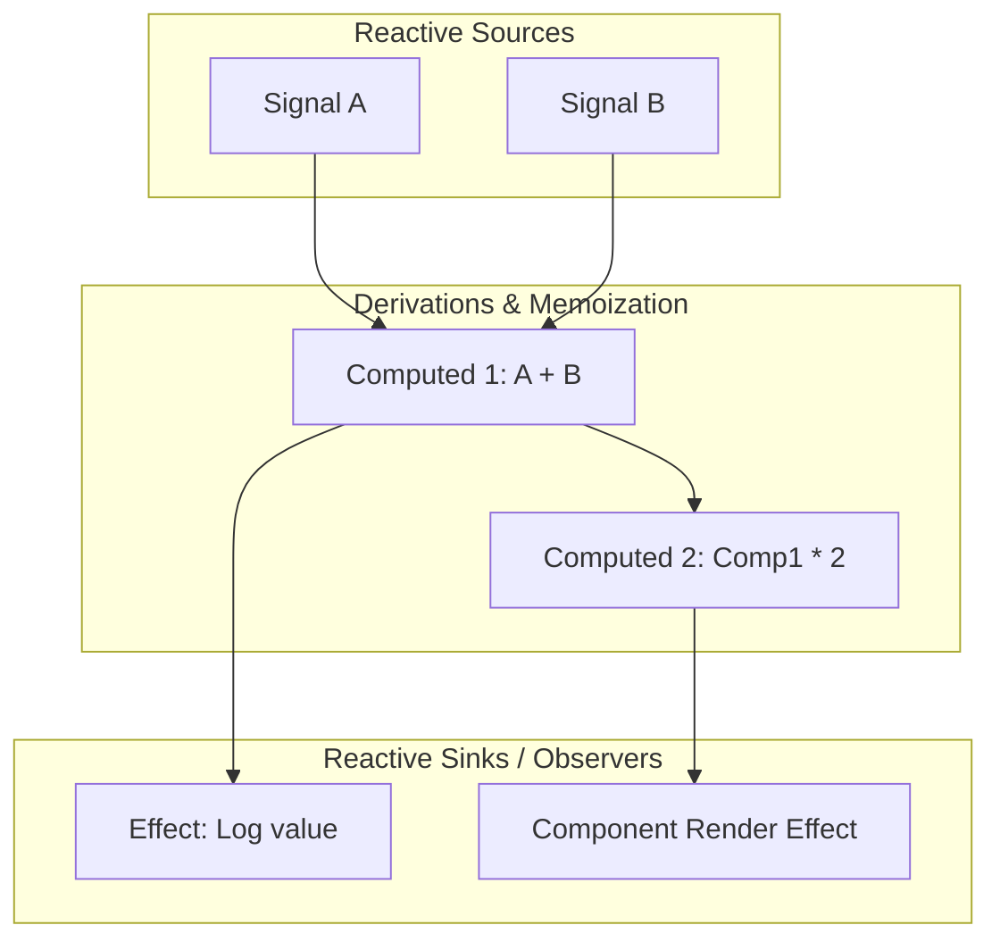

# Hydronium Fine-Grained Reactivity Engine

## 1. Overview & Core Philosophy

Hydronium implements a fine-grained, push-pull reactive dependency graph. Unlike frameworks that rely on component-level dirty checking, virtual DOM diffing for state changes, or compiler-driven transforms, Hydronium tracks state dependencies at the individual variable level at runtime.



### Core Characteristics:
- **Zero Compiler Magic**: Pure runtime Lua. No AST transforms or transpilation steps required.
- **Glitch-Free**: Updates propagate deterministically through topological evaluation orders, preventing intermediate inconsistent states (diamond problem).
- **Dynamic Dependency Pruning**: Dependencies are tracked dynamically during evaluation. Conditional branches (`if cond() then a() else b() end`) automatically prune inactive dependencies.
- **Strict Phase Segregation (Amendment 3)**: Mutations during the render phase raise fatal errors (`ERR_RENDER_MUTATION`), and effect-driven signal mutations are queued safely.

---

## 2. Reactive Primitives

### 2.1 Signals (`createSignal` / `signal`)
A signal is a mutable reactive value cell.

#### Multi-Syntax Ergonomics
Hydronium signals support multiple Lua calling conventions seamlessly:

```lua
local H = require("hydronium")

-- 1. Tuple unpacking (SolidJS / React style)
local count, setCount = H.createSignal(0)
print(count())       -- read: 0
setCount(1)          -- write: 1

-- 2. Callable table (S.js / Knockout style)
local count = H.signal(0)
print(count())       -- read: 0
count(2)             -- write: 2

-- 3. Object-oriented property and method style
print(count.value)   -- read: 2
count.value = 3      -- write: 3
count:set(4)         -- write: 4
print(count:get())   -- read: 4
```

#### Equality Check
Signals use Lua identity / value comparison (`oldValue == newValue`). Setting a signal to its current value is a no-op; downstream observers are not notified.

#### Render-Phase Mutation Guard (Amendment 3)
Mutating a signal while a component is actively executing its render function throws an explicit diagnostic error:
```lua
-- Throws: Hydronium Error [render]: State mutation is prohibited during the render phase.
```

---

### 2.2 Computeds (`createComputed` / `computed`)
A computed is a lazily evaluated, memoized derivation of one or more reactive sources.

```lua
local firstName, setFirstName = H.createSignal("Ada")
local lastName, setLastName = H.createSignal("Lovelace")

local fullName = H.createComputed(function()
  return firstName() .. " " .. lastName()
end)

print(fullName()) -- "Ada Lovelace" (Evaluated and memoized)

-- Changing an upstream signal marks the computed as dirty
setFirstName("Augusta")
print(fullName()) -- "Augusta Lovelace" (Re-evaluated on read)
```

#### Characteristics:
- **Lazy Evaluation**: Computeds do not re-run immediately when dependencies change. They mark themselves as dirty and only re-evaluate when their value is actually read.
- **Memoization**: If no upstream dependencies change, subsequent reads return the cached value instantly without invoking the computation function.
- **Glitch Prevention**: Diamond dependency graphs evaluate cleanly:
  ```
        Signal X
        /      \
    Comp A    Comp B
        \      /
        Comp C
  ```
  When Signal X changes, Comp C reads the updated values of both Comp A and Comp B in a single coherent pass.

---

### 2.3 Effects (`createEffect` / `effect`)
An effect is a reactive observer that runs side-effects when dependencies update.

```lua
local count, setCount = H.createSignal(1)

H.createEffect(function()
  print("Current count is: " .. count())
  
  -- Optional cleanup return function
  return function()
    print("Cleaning up previous count effect: " .. count())
  end
end)
-- Output: Current count is: 1

setCount(2)
-- Output:
-- Cleaning up previous count effect: 1
-- Current count is: 2
```

#### Characteristics:
- **Immediate Initial Execution**: Effects run synchronously upon creation to capture their initial dependency set.
- **Resilient Cleanups (Amendment 2)**: Effect cleanups run prior to re-execution and on scope disposal. Each cleanup is isolated within a `pcall`. If a cleanup throws an error, the error is recorded and execution continues safely.
- **Effect-Signal Queueing (Amendment 3)**: If an effect mutates a signal, the resulting reactive cascade is queued. The current effect phase finishes completely before the next render phase begins.

---

## 3. Dynamic Dependency Graph & Pruning

Hydronium uses a dynamic tracking stack (`hydronium.signals.graph`).

### How Tracking Works
1. When an observer (Computed or Effect) executes, it pushes itself onto the global `ObserverStack`.
2. Any signal accessed during this execution reads the active observer from the top of the stack and creates a bi-directional edge:
   - `signal.observers[observer] = true`
   - `observer.dependencies[signal] = true`
3. When the observer completes, it pops itself from the stack.

### Dynamic Dependency Pruning
When conditional branches change at runtime, stale dependencies are pruned:

```lua
local useA, setUseA = H.createSignal(true)
local a, setA = H.createSignal("A")
local b, setB = H.createSignal("B")

H.createEffect(function()
  if useA() then
    print("Observed:", a())
  else
    print("Observed:", b())
  end
end)
```
- **Initial run**: Subscribed to `useA` and `a`. `b` is NOT subscribed. Mutating `b` does not trigger the effect.
- **Branch switch (`setUseA(false)`)**:
  - Before running, the effect clears its previous dependency links.
  - New run subscribes to `useA` and `b`.
  - Mutating `a` will now NOT trigger the effect.

---

## 4. Batched Transactions & Untrack

### 4.1 Batching (`batch`)
Batching groups multiple signal mutations into a single atomic flush, suppressing intermediate renders and effects:

```lua
local x, setX = H.createSignal(0)
local y, setY = H.createSignal(0)

H.createEffect(function()
  print("Point:", x(), y())
end)
-- Output: Point: 0 0

H.batch(function()
  setX(10)
  setY(20)
  setX(15)
end)
-- Output: Point: 15 20 (Executed exactly once at batch exit)
```

#### Transactional Rollback (`cancelBatch`)
If an unhandled error occurs within a `batch` block, Hydronium catches the error via `pcall`, cancels pending updates via `cancelBatch()`, and re-throws the error, preserving graph consistency (CRITIQUE_REPORT Amendment 5).

### 4.2 Untracking (`untrack`)
To read a signal inside an effect or computed without subscribing to it:

```lua
H.createEffect(function()
  local currentCount = count() -- Subscribed
  local currentTheme = H.untrack(function() return theme() end) -- Not subscribed
  print("Count changed to " .. currentCount .. " under theme " .. currentTheme)
end)
```

---

## 5. Reentrancy & Cycle Defenses

### Cycle Detection
If a signal mutation inside an effect causes a circular trigger loop:
```lua
H.createEffect(function()
  count(count() + 1) -- Infinite loop!
end)
```
Hydronium's phased scheduler detects the cycle:
- Tracks flush loop iterations.
- If iterations exceed `MAX_FLUSH_ITERATIONS = 100`, the scheduler aborts and raises:
  `"Cycle detected: maximum reactive update depth exceeded"`.

### Reentrancy Locking
The scheduler uses an internal `isFlushingFlag` reentrancy lock. Re-entrant calls to `flush()` during effect execution are enqueued rather than executed on a nested call stack, eliminating recursive stack overflows.
