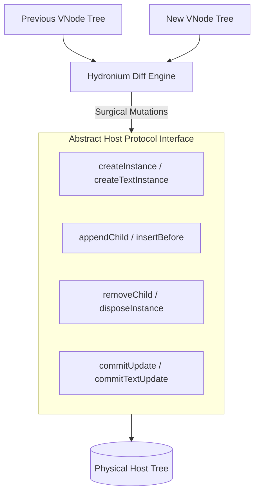

# Hydronium Reconciliation & Diffing Specification

## 1. Executive Summary

The Hydronium Reconciler (`hydronium.core.reconciler`) is a host-agnostic Virtual DOM diffing engine. It transforms declarative Virtual DOM representations (`VNode` trees) into concrete host platform structures (mock DOM, DOM nodes, game engine scene graphs, terminal ANSI blocks).



The reconciler ensures:
- **Minimal Host Mutations**: Elements of matching types and keys are updated in-place via `commitUpdate` rather than reconstructed.
- **Identity Preservation**: Keyed lists track nodes across insertions, deletions, reversals, and reordering.
- **Duplicate Key Resilience (Amendment 4)**: Duplicate sibling keys are disambiguated safely without dropping nodes or leaking resources.
- **Strict Cleanup Guarantees**: Unmounted subtrees recursively detach refs, invoke deferred cleanups in LIFO order, and dispose host resources.

---

## 2. The Abstract Host Protocol Interface

The reconciler communicates with the environment strictly via an injected `Host` table. The host must implement the following operations:

```lua
---@class HostInterface
---@field createInstance fun(type: string, props: table): HostNode
---@field createTextInstance fun(text: string): HostNode
---@field appendInitialChild fun(parent: HostNode, child: HostNode)
---@field appendChild fun(parent: HostNode, child: HostNode)
---@field insertBefore fun(parent: HostNode, child: HostNode, beforeChild: HostNode)
---@field removeChild fun(parent: HostNode, child: HostNode)
---@field commitUpdate fun(instance: HostNode, oldProps: table, newProps: table)
---@field commitTextUpdate fun(instance: HostNode, oldText: string, newText: string)
---@field disposeInstance fun(instance: HostNode)
```

### Operation Invariants
1. **`createInstance(type, props)`**: Instantiates a host element with initial properties. Child nodes must NOT be attached during this call.
2. **`appendInitialChild(parent, child)`**: Optimized child attachment used during initial subtree construction prior to mounting. Can default to `appendChild` if the host has no specialized offscreen batching.
3. **`insertBefore(parent, child, beforeChild)`**: Inserts `child` immediately before `beforeChild`. If `beforeChild` is `nil`, appends to the end of the child list.
4. **`removeChild(parent, child)`**: Detaches `child` from `parent`.
5. **`commitUpdate(instance, oldProps, newProps)`**: Applies prop differences (style, attributes, event handlers) to an existing host node.
6. **`commitTextUpdate(instance, oldText, newText)`**: Updates the textual payload of a text node without destroying the node.
7. **`disposeInstance(instance)`**: Releases platform-specific handles, texture allocations, or event subscriptions when a node is permanently discarded.

---

## 3. Diffing Algorithm

Reconciliation operates recursively comparing an `oldVNode` and `newVNode`.

### 3.1 Type Matching & Node Replacement
If `oldVNode` and `newVNode` do not share the exact same `type`:
1. The old subtree is completely unmounted via `unmount(oldVNode)`.
2. The new subtree is mounted via `mount(newVNode, parentInstance, beforeChild)`.
3. If replacing an existing child, `host.insertBefore(parentInstance, newVNode.hostNode, beforeChild)` is performed and `oldVNode.hostNode` is removed.

### 3.2 Text Reconciliation
When diffing text nodes (`Symbols.TEXT`):
- If `oldVNode.props.nodeValue ~= newVNode.props.nodeValue`, the reconciler invokes `host.commitTextUpdate(oldVNode.hostNode, oldVNode.props.nodeValue, newVNode.props.nodeValue)`.
- The physical `hostNode` reference is transferred to `newVNode`.

### 3.3 Element Reconciliation
When diffing intrinsic element nodes (`Symbols.ELEMENT`):
1. **Host Node Reuse**: `newVNode.hostNode = oldVNode.hostNode`.
2. **Prop Diffing**: If `oldVNode.props ~= newVNode.props`, `host.commitUpdate(newVNode.hostNode, oldVNode.props, newVNode.props)` is dispatched.
3. **Ref Swapping**: If `oldVNode.ref ~= newVNode.ref`, `oldVNode.ref` is detached and `newVNode.ref` is attached.
4. **Child Diffing**: The children list of `oldVNode` is reconciled against `newVNode.children`.

### 3.4 Component Reconciliation
When diffing component nodes (`Symbols.COMPONENT`):
1. The existing `ComponentInstance` stored in `oldVNode._instance` is transferred to `newVNode._instance`.
2. The component instance updates its internal props reference.
3. If props or context have changed, `instance:update(newVNode.props)` executes the render function and reconciles the resulting child VNode against the previous rendered output.

---

## 4. Child Diffing Strategy

Hydronium employs a hybrid diffing strategy that differentiates between **unkeyed** and **keyed** child sequences.

```mermaid
flowchart TD
    StartDiff[Reconcile Children] --> CheckKeys{Any child has key?}
    CheckKeys -->|No| UnkeyedDiff[Unkeyed Diff: By Index]
    CheckKeys -->|Yes| KeyedDiff[Keyed Diff: Key Map Matching]
    
    UnkeyedDiff --> SameLen[Diff 1..Min(Old, New)]
    UnkeyedDiff --> Shrink[Remove Old beyond New length]
    UnkeyedDiff --> Grow[Mount New beyond Old length]
    
    KeyedDiff --> BuildMap[Build Disambiguated Old Key Map]
    KeyedDiff --> MatchKeys[Traverse New Children: Match & Move]
    KeyedDiff --> CleanupRemaining[Unmount Unmatched Old Nodes]
```

### 4.1 Unkeyed Child Diffing (Index-Based)
When children have no explicit `key`:
- The algorithm pairs children by sequential index `1 .. math.min(#oldChildren, #newChildren)`.
- If `#oldChildren > #newChildren`, excess old children from `#newChildren + 1` to `#oldChildren` are unmounted.
- If `#newChildren > #oldChildren`, new children from `#oldChildren + 1` to `#newChildren` are mounted and appended.

### 4.2 Keyed Child Diffing (Key Map Matching)
When any child contains a non-nil `key`, keyed reconciliation activates:
1. **Old Key Map Creation**:
   A lookup table `oldKeyMap` is populated mapping keys to `{ vnode = oldVNode, index = i }`.
2. **Key Disambiguation (Amendment 4)**:
   If duplicate keys occur in the array, Hydronium tracks occurrences and disambiguates the key suffix (`key .. ":__dup_" .. count`). This prevents collision overwrites, ensuring no nodes are orphaned or mistakenly unmounted.
3. **New Child Traversal**:
   Each new child's disambiguated key is checked against `oldKeyMap`:
   - **Match Found**: The matched old VNode is reconciled with the new VNode. If the node's position changed, `host.insertBefore` adjusts its physical location in the host. The matched key is cleared from `oldKeyMap`.
   - **No Match**: The new child is fresh. It is mounted via `mount(newChild, parentInstance, nextHostNode)`.
4. **Unmounting Stragglers**:
   Any old VNodes remaining in `oldKeyMap` were not present in the new tree and are systematically unmounted.

---

## 5. Duplicate Key Hardening (Amendment 4)

In standard React, duplicate keys trigger console warnings and produce undefined reconciliation behavior (often crashing or unmounting the wrong sibling). Hydronium guarantees structural integrity even when user code supplies duplicate keys:

```lua
-- Duplicate key resolution implementation in reconciler.lua
local function buildKey(vnode, index, counts)
  local rawKey = vnode and vnode.key
  if rawKey == nil then
    return "__index_" .. index
  end
  local strKey = tostring(rawKey)
  local count = counts[strKey] or 0
  counts[strKey] = count + 1
  if count == 0 then
    return strKey
  else
    return strKey .. ":__dup_" .. count
  end
end
```

### Invariants Maintained:
- **100% Deterministic**: Given the same duplicate sequence across renders, keys resolve to identical disambiguated names.
- **Zero Orphaned Nodes**: Every host node remains tracked.
- **Safe State Retention**: Closure scopes associated with duplicate-keyed components remain intact unless explicitly deleted.

---

## 6. Fragment Unwrapping

Fragments (`Symbols.FRAGMENT` or `<>` in JSX) allow returning lists of sibling nodes without introducing an extra host container node.

### Invariants:
1. **Container Bypass**: A Fragment does not create a physical host node (`vnode.hostNode == nil`).
2. **Direct Parent Mounting**: Children of a Fragment are mounted directly into the Fragment's enclosing host container.
3. **Nested Fragments**: Fragments can be nested to arbitrary depths. Child flattening recursively unwraps nested fragments.
4. **Recursive Unmounting**: Unmounting a Fragment unmounts all of its constituent children recursively, ensuring all host nodes and scopes are cleaned up.

---

## 7. Ref Binding Lifecycle

Hydronium supports two forms of refs:
1. **Object Refs**: Tables containing a `.current` field, created via `H.createRef()`.
2. **Callback Refs**: Functions of the signature `function(instance) ... end`.

### Execution Timeline:
- **Mount**: Immediately after `createInstance` and child attachment, before effects run:
  - Object Ref: `ref.current = hostNode`
  - Callback Ref: `ref(hostNode)`
- **Update (Ref Change)**: If a component re-renders with a different callback or ref object:
  - Old callback invoked with `nil`.
  - New callback invoked with `hostNode`.
- **Unmount**:
  - Object Ref: `ref.current = nil`
  - Callback Ref: `ref(nil)`

All callback ref invocations are wrapped in `pcall` to prevent uncaught host errors during teardown.

---

## 8. Disposal & Scope Hierarchy Invariants

When an element or component is removed from the Virtual DOM, Hydronium enforces **bottom-up disposal**:

```mermaid
flowchart TD
    UnmountParent[Unmount Parent Component] --> UnmountChildren[Unmount Children First]
    UnmountChildren --> HostRemove[host.removeChild & disposeInstance]
    HostRemove --> RefDetach[Detach Refs: ref(nil)]
    RefDetach --> ScopeDispose[scope:dispose(): LIFO Cleanups]
```

1. **Children Before Parents**: Child component scopes and descendant host instances are disposed before parent cleanup callbacks run. This prevents parent cleanups from observing half-torn-down child hierarchies.
2. **LIFO Cleanups**: Cleanup handlers registered via `scope:defer` or `onCleanup` run in reverse order of registration.
3. **Resilient Execution**: If a cleanup callback throws an error, the error is recorded, and subsequent cleanups continue running to prevent memory leaks.
