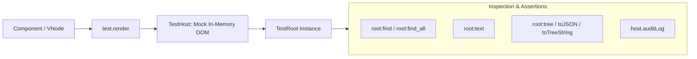

# Hydronium Test Renderer Specification

## 1. Overview & Objectives

The Hydronium Test Renderer (`hydronium.test`) provides an in-memory testing framework that simulates rendering without requiring a physical DOM, windowing subsystem, or graphics context.



### Key Capabilities:
- **Fast In-Memory Execution**: Executes tests in sub-millisecond durations under LuaJIT and standard Lua.
- **Structural Tree Inspection**: Inspects the rendered tree as plain Lua tables (`root:tree()`), JSON (`root:toJSON()`), or indented text (`root:toTreeString()`).
- **Flexible Node Querying**: Search by string tag, prop matching tables, or custom predicate functions.
- **Audit Logging**: Captures every low-level host operation (`createInstance`, `commitUpdate`, etc.) to verify reconciliation efficiency.
- **`act()` Boundary**: Synchronously flushes all pending reactive updates and scheduler phases to ensure deterministic test assertions.

---

## 2. API Reference

### 2.1 Mounting & Test Roots

#### `test.render(vnode)`
Mounts a VNode into a newly created `TestHost` and returns a `TestRoot` handle.
Supports both camelCase (`test.render`) and snake_case (`test.create_test_root`).

```lua
local H = require("hydronium")

local root = H.test.render(H.h("div", { class = "container" },
  H.h("h1", nil, "Title"),
  H.h("p", nil, "Content")
))
```

---

### 2.2 Tree Inspection & Snapshotting

#### `root:tree()`
Returns a clean, serializable Lua table representation of the rendered node tree:
```lua
local tree = root:tree()
-- {
--   type = "div",
--   props = { class = "container" },
--   children = {
--     { type = "h1", props = {}, children = { "Title" } },
--     { type = "p", props = {}, children = { "Content" } }
--   }
-- }
```

#### `root:toJSON(pretty)`
Serializes the rendered tree into a standard JSON string. When `pretty = true`, outputs formatted indented JSON.

#### `root:toTreeString()`
Returns a human-readable ASCII tree representation suitable for terminal debugging:
```
<div class="container">
  <h1>
    "Title"
  </h1>
  <p>
    "Content"
  </p>
</div>
```

#### `root:text()`
Recursively extracts and concatenates all text node values within the tree:
```lua
local text = root:text()
assert(text == "TitleContent")
```

---

### 2.3 Querying Nodes

Hydronium test roots provide expressive querying functions supporting both colon (`root:find(...)`) and dot (`root.find(...)`) notation:

#### `root:find(query)`
Returns the first descendant node that matches `query`, or `nil` if not found.

#### `root:find_all(query)`
Returns a contiguous array of all descendant nodes matching `query`.

#### Query Formats:
1. **String (Tag Name)**:
   ```lua
   local button = root:find("button")
   ```
2. **Table (Prop Matching)**:
   ```lua
   local primaryBtn = root:find({ class = "btn-primary", type = "submit" })
   ```
3. **Predicate Function**:
   ```lua
   local item = root:find(function(node)
     return node.props.disabled == true
   end)
   ```

---

### 2.4 Lifecycle & Synchronization

#### `root:update(newVNode)`
Re-renders the root container with an updated VNode tree, running reconciliation diffing.

#### `root:unmount()`
Unmounts the root tree, disposing all child scopes, executing cleanups in LIFO order, detaching refs, and clearing host instances.

#### `test.act(callback)`
Wraps an operation in a synchronous execution boundary. Ensures all signal updates, computed evaluations, render phases, commit mutations, and effect queues are flushed before proceeding:

```lua
H.test.act(function()
  setCount(10)
end)

-- Guaranteed that all effects and renders have executed
assert(root:find("span").children[1] == "10")
```

---

## 3. Comprehensive Testing Patterns

### 3.1 Testing Reactive State Changes
```lua
local function Counter()
  local count, setCount = H.createSignal(0)
  return function()
    return H.h("div", nil,
      H.h("span", nil, "Count: " .. count()),
      H.h("button", { onClick = function() setCount(count() + 1) end }, "Add")
    )
  end
end

-- Test execution
local root = H.test.render(H.h(Counter))
assert(root:text() == "Count: 0Add")

local button = root:find("button")

-- Trigger event inside act
H.test.act(function()
  button.props.onClick()
end)

assert(root:text() == "Count: 1Add")
```

### 3.2 Testing Error Boundaries
```lua
local function FaultyComponent(props)
  if props.fail then
    error("Component crashed intentionally")
  end
  return H.h("div", nil, "Normal Render")
end

local root = H.test.render(
  H.h(H.ErrorBoundary, {
    fallback = function(err)
      return H.h("div", { role = "alert" }, "Recovered: " .. err.message)
    end
  },
    H.h(FaultyComponent, { fail = true })
  )
)

local alert = root:find({ role = "alert" })
assert(alert ~= nil)
assert(alert.children[1] == "Recovered: Component crashed intentionally")
```

### 3.3 Verifying Minimal Host Mutations
```lua
local host = H.test.Host.new()
local root = H.createRoot(host)

root:render(H.h("div", { title = "Initial" }, "Text"))

local initialOpCount = #host.auditLog

root:render(H.h("div", { title = "Updated" }, "Text"))

-- Verify that node was not destroyed and recreated
local hasRemove = false
for i = initialOpCount + 1, #host.auditLog do
  if host.auditLog[i].op == "removeChild" then
    hasRemove = true
  end
end
assert(hasRemove == false, "Element was unnecessarily recreated instead of updated in-place!")
```
