# Upstream UI Architecture Audit & Comparative Analysis

## 1. Executive Summary

Hydronium is engineered at the intersection of three major paradigms in modern UI architecture:
1. **Fine-Grained Reactive Graphs** (pioneered by S.js and SolidJS).
2. **Host-Agnostic Virtual DOM Reconciliation** (pioneered by React and Preact).
3. **Lexical Setup-Once Closures** (inspired by Vue 3 Composition API and Mithril).

This document presents a comprehensive technical audit comparing Hydronium's architectural decisions against React, SolidJS, Preact, Vue 3, and Svelte, with specific focus on how Lua runtime characteristics dictated these choices.

---

## 2. Comparative Architecture Matrix

| Dimension | React (Fiber) | SolidJS | Preact | Vue 3 | Svelte 5 (Runes) | **Hydronium** |
| :--- | :--- | :--- | :--- | :--- | :--- | :--- |
| **Reactivity Model** | Coarse VDOM Dirty Checking | Fine-Grained Reactive Graph | Coarse VDOM + Signals | Proxy-based Reactive Graph | Compiler-driven Signals | **Fine-Grained Push-Pull Graph** |
| **Update Granularity** | Component Subtree | Variable / DOM Node | Component Subtree | Component Subtree | Variable / DOM Node | **Component Subtree via Reactive Signals** |
| **Component Execution** | Top-to-Bottom Every Render | Setup-Once (Never Re-runs) | Top-to-Bottom Every Render | Setup-Once + Render Effect | Setup-Once | **Dual: Pure Functional OR Setup-Once Closures** |
| **Virtual DOM** | Heavy Fiber Node Tree | None (Direct DOM mutations) | Lightweight VDOM Tree | Compiler-Optimized VDOM (Block Tree) | None (Direct DOM mutations) | **Host-Agnostic Lightweight VDOM** |
| **Build-Step / Compiler** | Required (JSX / Babel / SWC) | Required (JSX -> DOM templates) | Optional (JSX or `htm`) | Optional (Templates or JSX) | Required (Svelte Compiler) | **Zero Build Step: 100% Pure Lua Runtime** |
| **Host Portability** | Custom Reconciler (`react-reconciler`) | DOM-focused (universal renderer via custom transform) | DOM-focused | Custom Renderer (`@vue/runtime-core`) | DOM-focused | **First-Class Host Protocol (`HostInterface`)** |
| **Target Platforms** | Web, Native (React Native) | Web | Web | Web | Web | **Game Engines (LÖVE, Defold, Raylib), TUI, Web** |

---

## 3. Deep-Dive Paradigm Comparisons

```mermaid
flowchart TD
    subgraph ReactFiber [React Fiber]
        RState[State Change] --> RComp[Re-run Component Function]
        RComp --> RDiff[Diff Fiber WorkInProgress Tree]
        RDiff --> RCommit[Commit DOM Mutations]
    end

    subgraph SolidEngine [SolidJS]
        SState[Signal Change] --> SDirect[Direct DOM Element Mutation]
    end

    subgraph HydroniumPipeline [Hydronium Pipeline]
        HState[Signal Change] --> HSchedule[Phased Scheduler: Mutation Phase]
        HSchedule --> HRender[Render Phase: Re-run Dirty Components]
        HRender --> HCommit[Commit Phase: Host Protocol Mutations]
        HCommit --> HEffect[Effect Phase: Run Queued Observers]
    end
```

### 3.1 Hydronium vs. React (Fiber)
- **Component Execution Overhead**: React re-executes the entire component function on every state update, re-allocating inline closures, dependency arrays, and hook states. Hydronium's Closure Components execute setup **once**, keeping persistent signals and local state in the lexical environment.
- **Hook Rules**: React enforces rigid "Rules of Hooks" (no hooks inside conditions, loops, or nested functions) because hooks rely on an implicit array index pointer in Fiber nodes. Hydronium has **zero hook rules**; state primitives (`createSignal`, `createEffect`) are first-class objects created in setup.
- **Scheduling**: React Fiber uses cooperative time-slicing (`requestIdleCallback` / message channels). Hydronium employs a deterministic 4-phase scheduler (Mutation -> Render -> Commit -> Effect) designed for fixed-timestep game loops and synchronous test execution.

---

### 3.2 Hydronium vs. SolidJS
- **Virtual DOM vs. Direct Mutations**: SolidJS compiles JSX into direct DOM template clones and fine-grained DOM property bindings, eliminating the Virtual DOM entirely. 
- **Why Hydronium Retains a Virtual DOM**:
  - In web browsers, the DOM is a standardized, known target with native APIs (`cloneNode`, `appendChild`).
  - In Lua, target platforms are wildly heterogeneous: LÖVE 2D draws immediate canvas shapes, Raylib uses immediate/retained buffers, Defold uses native C++ GUI handles, and terminal TUIs use 2D character grids.
  - A lightweight Virtual DOM with an abstract `HostInterface` is the most expressive, cross-platform abstraction for non-browser runtimes that lack a universal DOM.

---

### 3.3 Hydronium vs. Preact
- **Lightweight Virtual DOM**: Hydronium shares Preact's philosophy of minimal overhead and zero unnecessary abstractions.
- **Immutability & Safety**: Preact mutates VNodes internally during diffing. Hydronium preserves immutable VNodes and freezes props to prevent race conditions across parallel updates.
- **Keys & Disambiguation**: Preact exhibits unmounting artifacts when keys collide. Hydronium incorporates **Amendment 4 (Duplicate Key Hardening)**, disambiguating keys deterministically to prevent orphaned nodes.

---

### 3.4 Hydronium vs. Vue 3 (Composition API)
- **Reactivity Mechanism**: Vue 3 relies on ES6 `Proxy` objects to intercept property access. In Lua, metatables provide similar interception (`__index`, `__newindex`), but standard Lua metatables have performance implications in LuaJIT.
- Hydronium separates value cells into explicit getter/setter signals (`count()` / `setCount(v)`), avoiding proxy overhead on general data tables.

---

## 4. Lua Runtime Constraints & Engineering Solutions

### 4.1 Garbage Collection Pressure in 60/120 FPS Environments
In game development (LÖVE 2D, Defold), periodic garbage collection spikes cause frame drops (jank).
- **Setup-Once Closures**: Allocations for signals, handlers, and memoized values occur during setup, not during the 60 FPS render cycle.
- **Reusable Node Stores**: VNode creation uses flat table layouts that JIT compilers optimize into low-overhead NYI-free traces.

### 4.2 Lua Table Mechanics & Hash Lookups
- Lua arrays are 1-indexed tables with contiguous integer keys. LuaJIT optimizes these into raw C-like array access.
- In `hydronium.core.element`, child normalization creates contiguous 1-indexed tables using `select("#", ...)`, preventing hash-part allocation and table rehashing.

### 4.3 Absence of Weak Collections in Standard Lua 5.1
- While Lua 5.1 has weak tables (`__mode = "k"` or `"v"`), ephemeron semantics are not fully realized until Lua 5.2+.
- Hydronium does not rely on weak tables to clean up reactive dependencies. Instead, it enforces explicit **Hierarchical Scopes** (`hydronium.core.scope`). When a component unmounts, its scope systematically unlinks all observer dependencies from signals, preventing dangling references.
